# Design Modelling

## UML Models Overview

This document contains the complete UML model set for the Unified Patient Access & Clinical Intelligence Platform, derived from the functional requirements specification (`spec.md`) and architecture design (`design.md`). All 31 diagrams are organised into two sections:

**Architectural Views** capture the system's structural and behavioural architecture across four perspectives:
- **DM-001 Component Architecture** — illustrates the Clean Architecture layering (React SPA → API → Application → Domain → Infrastructure) with all internal services and their integration points to external systems (Gemini, Supabase/PostgreSQL, Upstash Redis, Hangfire, Google Calendar API, Microsoft Graph API, Email/SMS Gateway).
- **DM-002 Deployment Architecture** — shows how each component is hosted on free-tier infrastructure (InfinityFree, MonsterASP/IIS, Supabase, Upstash Redis, GitHub Actions) with security boundaries.
- **DM-003 Data Flow** — traces data movement from patient-facing inputs through the backend processing pipeline (intake, document ingestion, AI extraction, profile aggregation, code suggestion) to persistence in Supabase/PostgreSQL.
- **DM-004 Logical Data Model (ERD)** — defines all 14 domain entities (User, Appointment, AppointmentSlot, WaitlistEntry, IntakeRecord, ClinicalDocument, ExtractedClinicalData, PatientProfile360, DataConflict, MedicalCodeSuggestion, AuditLog, Notification, InsuranceRecord, CalendarSync) with attributes, relationships, and cardinality.

**AI Architecture Diagrams** ($AI_SIGNAL = true) cover the three AI-enabled use cases with Gemini function calling / structured output:
- **AI-009** — UC-009 AI Conversational Intake (guardrails, structured JSON extraction, fallback to manual)
- **AI-021** — UC-021 AI Clinical Data Extraction (PdfPig text extraction → Gemini → schema validation → profile update)
- **AI-023** — UC-023 AI Medical Code Suggestion (encounter context → Gemini → ranked ICD-10/CPT candidates → human gate)

**Use Case Sequence Diagrams** (SQ-001 through SQ-025) provide one Mermaid `sequenceDiagram` per UC-XXX from the specification, covering all 25 use cases with success flows, at least one alternative flow, and at least one error/exception path.

*Navigation:* Jump to any diagram using the heading anchors: [DM-001](#component-architecture-diagram) · [DM-002](#deployment-architecture-diagram) · [DM-003](#data-flow-diagram) · [DM-004](#logical-data-model-erd) · [AI-009](#ai-sequence-diagram--uc-009-ai-conversational-intake) · [AI-021](#ai-sequence-diagram--uc-021-ai-clinical-data-extraction) · [AI-023](#ai-sequence-diagram--uc-023-ai-medical-code-suggestion) · [SQ-001](#uc-001-patient-self-registration) → [SQ-025](#uc-025-generate-and-email-pdf-confirmation)

---

## Architectural Views

### Component Architecture Diagram

<!-- RENDER type="mermaid" src="./uml-models/component-architecture.png" -->

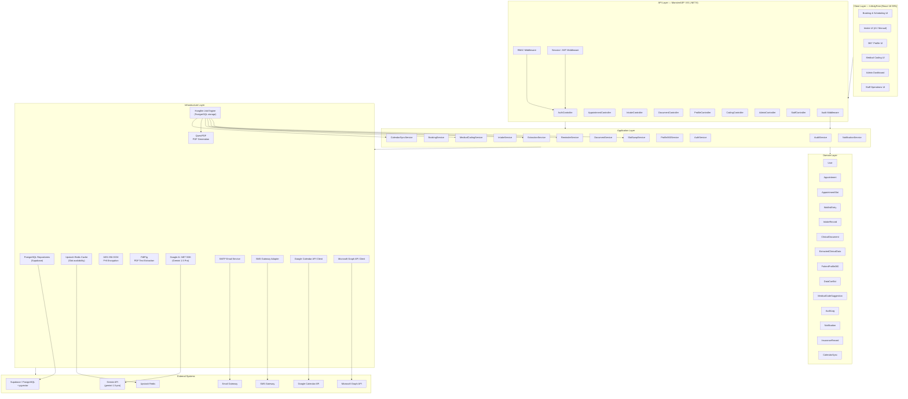
```mermaid
graph TB
    subgraph Client["Client Layer — InfinityFree (React 18 SPA)"]
        UI_BOOKING["Booking & Scheduling UI"]
        UI_INTAKE["Intake UI (AI / Manual)"]
        UI_PROFILE["360° Profile UI"]
        UI_CODING["Medical Coding UI"]
        UI_ADMIN["Admin Dashboard"]
        UI_STAFF["Staff Operations UI"]
    end

    subgraph API["API Layer — MonsterASP / IIS (.NET 8)"]
        CTRL_AUTH["AuthController"]
        CTRL_APPT["AppointmentController"]
        CTRL_INTAKE["IntakeController"]
        CTRL_DOC["DocumentController"]
        CTRL_PROFILE["ProfileController"]
        CTRL_CODING["CodingController"]
        CTRL_ADMIN["AdminController"]
        CTRL_STAFF["StaffController"]
        MW_RBAC["RBAC Middleware"]
        MW_SESSION["Session / JWT Middleware"]
        MW_AUDIT["Audit Middleware"]
    end

    subgraph APP["Application Layer"]
        SVC_AUTH["AuthService"]
        SVC_BOOKING["BookingService"]
        SVC_SWAP["SlotSwapService"]
        SVC_INTAKE["IntakeService"]
        SVC_REMINDER["ReminderService"]
        SVC_CALENDAR["CalendarSyncService"]
        SVC_DOC["DocumentService"]
        SVC_EXTRACTION["ExtractionService"]
        SVC_PROFILE["Profile360Service"]
        SVC_CODING["MedicalCodingService"]
        SVC_AUDIT["AuditService"]
        SVC_NOTIFY["NotificationService"]
    end

    subgraph DOMAIN["Domain Layer"]
        ENT_USER["User"]
        ENT_APPT["Appointment"]
        ENT_SLOT["AppointmentSlot"]
        ENT_WAITLIST["WaitlistEntry"]
        ENT_INTAKE["IntakeRecord"]
        ENT_DOC["ClinicalDocument"]
        ENT_EXTRACT["ExtractedClinicalData"]
        ENT_PROFILE["PatientProfile360"]
        ENT_CONFLICT["DataConflict"]
        ENT_CODE["MedicalCodeSuggestion"]
        ENT_AUDIT["AuditLog"]
        ENT_NOTIFY["Notification"]
        ENT_INS["InsuranceRecord"]
        ENT_CAL["CalendarSync"]
    end

    subgraph INFRA["Infrastructure Layer"]
        REPO_PG["PostgreSQL Repositories\n(Supabase)"]
        CACHE_REDIS["Upstash Redis Cache\n(Slot availability)"]
        JOB_HF["Hangfire Job Engine\n(PostgreSQL storage)"]
        ENC_AES["AES-256-GCM\nPHI Encryption"]
        PDF_GEN["QuestPDF\nPDF Generation"]
        PDF_PARSE["PdfPig\nPDF Text Extraction"]
        AI_CLIENT["Google AI .NET SDK\n(Gemini 1.5 Pro)"]
        EMAIL_SVC["SMTP Email Service"]
        SMS_SVC["SMS Gateway Adapter"]
        CAL_GOOGLE["Google Calendar API Client"]
        CAL_OUTLOOK["Microsoft Graph API Client"]
    end

    subgraph EXT["External Systems"]
        GEMINI["Gemini API\n(gemini-1.5-pro)"]
        SUPABASE["Supabase / PostgreSQL\n+ pgvector"]
        REDIS["Upstash Redis"]
        GCAL_EXT["Google Calendar API"]
        OUTLOOK_EXT["Microsoft Graph API"]
        EMAIL_GW["Email Gateway"]
        SMS_GW["SMS Gateway"]
    end

    Client --> API
    API --> APP
    APP --> DOMAIN
    APP --> INFRA
    INFRA --> EXT

    MW_RBAC --> CTRL_AUTH
    MW_SESSION --> CTRL_AUTH
    MW_AUDIT --> APP

    JOB_HF --> SVC_SWAP
    JOB_HF --> SVC_REMINDER
    JOB_HF --> SVC_EXTRACTION
    JOB_HF --> SVC_CODING
    JOB_HF --> PDF_GEN
    JOB_HF --> SVC_CALENDAR

    AI_CLIENT --> GEMINI
    REPO_PG --> SUPABASE
    CACHE_REDIS --> REDIS
    CAL_GOOGLE --> GCAL_EXT
    CAL_OUTLOOK --> OUTLOOK_EXT
    EMAIL_SVC --> EMAIL_GW
    SMS_SVC --> SMS_GW
```

---

### Deployment Architecture Diagram

<!-- RENDER type="plantuml" src="./uml-models/deployment-architecture.png" -->

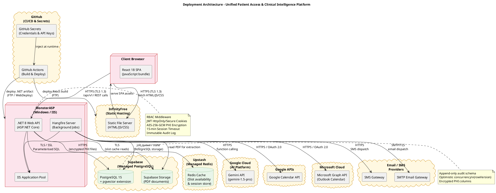
```plantuml
@startuml deployment-architecture
skinparam componentStyle rectangle
skinparam rectangle {
  BackgroundColor #EEF4FF
  BorderColor #336699
}
skinparam cloud {
  BackgroundColor #FFF8E1
  BorderColor #CC8800
}
skinparam database {
  BackgroundColor #E8F5E9
  BorderColor #388E3C
}
skinparam node {
  BackgroundColor #FCE4EC
  BorderColor #C62828
}

title Deployment Architecture – Unified Patient Access & Clinical Intelligence Platform

node "Client Browser" as BROWSER {
  component "React 18 SPA\n(JavaScript bundle)" as SPA
}

cloud "InfinityFree\n(Static Hosting)" as INFINITYFREE {
  component "Static File Server\n(HTML/JS/CSS)" as STATIC
}

node "MonsterASP\n(Windows / IIS)" as MONSTERAPSP {
  component ".NET 8 Web API\n(ASP.NET Core)" as DOTNET
  component "Hangfire Server\n(Background Jobs)" as HANGFIRE
  component "IIS Application Pool" as IIS
  DOTNET --> IIS
  HANGFIRE --> IIS
}

cloud "Supabase\n(Managed PostgreSQL)" as SUPABASE {
  database "PostgreSQL 15\n+ pgvector extension" as PG
  database "Supabase Storage\n(PDF documents)" as STORAGE
}

cloud "Upstash\n(Managed Redis)" as UPSTASH {
  database "Redis Cache\n(Slot availability\n& session store)" as REDIS
}

cloud "Google Cloud\n(AI Platform)" as GOOGLE_AI {
  component "Gemini API\n(gemini-1.5-pro)" as GEMINI
}

cloud "Google APIs" as GCAL_CLOUD {
  component "Google Calendar API" as GCAL_API
}

cloud "Microsoft Cloud" as MS_CLOUD {
  component "Microsoft Graph API\n(Outlook Calendar)" as GRAPH_API
}

cloud "Email / SMS\nProviders" as NOTIFY_CLOUD {
  component "SMTP Email Gateway" as SMTP
  component "SMS Gateway" as SMS
}

cloud "GitHub\n(CI/CD & Secrets)" as GITHUB {
  component "GitHub Actions\n(Build & Deploy)" as GHA
  component "GitHub Secrets\n(Credentials & API Keys)" as SECRETS
}

BROWSER --> STATIC : HTTPS (TLS 1.3)\nfetch HTML/JS/CSS
BROWSER --> DOTNET : HTTPS (TLS 1.3)\n/api/v1/ REST calls
STATIC --> BROWSER : serve SPA assets

DOTNET --> PG : TLS / SSL\nParameterised SQL
DOTNET --> STORAGE : HTTPS\n(encrypted PHI files)
DOTNET --> REDIS : TLS\n(slot cache reads)
HANGFIRE --> PG : job queue / state\n(PostgreSQL storage)
HANGFIRE --> GEMINI : HTTPS\nfunction calling
HANGFIRE --> SMTP : SMTP/TLS\nemail dispatch
HANGFIRE --> SMS : HTTPS\nSMS dispatch
HANGFIRE --> GCAL_API : HTTPS / OAuth 2.0
HANGFIRE --> GRAPH_API : HTTPS / OAuth 2.0
HANGFIRE --> STORAGE : read PDF for extraction

GHA --> MONSTERAPSP : deploy .NET artifact\n(FTP / WebDeploy)
GHA --> INFINITYFREE : deploy React build\n(FTP)
SECRETS --> GHA : inject at runtime

note right of DOTNET
  RBAC Middleware
  JWT HttpOnly/Secure Cookies
  AES-256-GCM PHI Encryption
  15-min Session Timeout
  Immutable Audit Log
end note

note right of PG
  Append-only audit schema
  Optimistic concurrency\n(rowVersion)
  Encrypted PHI columns
end note
@enduml
```

#### Enhanced Deployment Details [CONDITIONAL: infrastructure specification available]

| Component | Specification | Source |
|-----------|---------------|--------|
| Frontend Hosting | InfinityFree static file server; React 18 SPA; HTTPS enforced | TR-001 |
| Backend Compute | MonsterASP Windows/IIS; .NET 8 Application Pool; single-instance (free tier) | TR-018 |
| Background Jobs | Hangfire Server co-hosted on MonsterASP; PostgreSQL job storage | TR-004 |
| Database | Supabase managed PostgreSQL 15 + pgvector extension; free tier (500 MB) | TR-003, DR-004 |
| Blob Storage | Supabase Storage; server-side encrypted; free tier (1 GB) | DR-005 |
| Cache | Upstash Redis; TLS enforced; TTL ≤ 5s for slot availability | TR-005 |
| AI Service | Gemini API (gemini-1.5-pro); Google AI .NET SDK; function calling mode | TR-006 |
| CI/CD | GitHub Actions; GitHub Secrets for all credentials; FTP deployment to MonsterASP and InfinityFree | TR-012 |
| Security | JWT in HttpOnly/Secure/SameSite=Strict cookies; AES-256-GCM at application layer; RBAC on all endpoints | TR-007, TR-015 |
| Monitoring | Hangfire dashboard (internal); Supabase telemetry; application logs (no PHI in log fields) | NFR-007 |

---

### Data Flow Diagram

<!-- RENDER type="plantuml" src="./uml-models/data-flow.png" -->

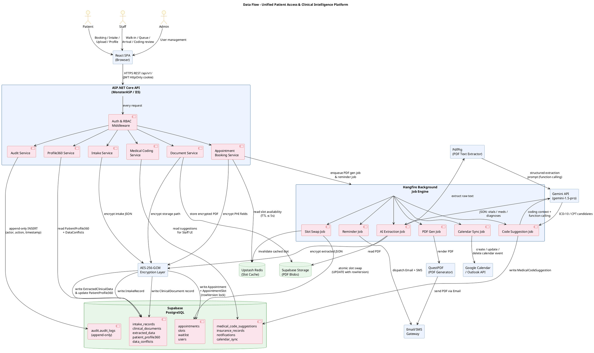
```plantuml
@startuml data-flow
skinparam rectangle {
  BackgroundColor #EEF4FF
  BorderColor #336699
}
skinparam database {
  BackgroundColor #E8F5E9
  BorderColor #388E3C
}
skinparam actor {
  BackgroundColor #FFFBE6
  BorderColor #CC8800
}
skinparam component {
  BackgroundColor #FCE4EC
  BorderColor #C62828
}

title Data Flow – Unified Patient Access & Clinical Intelligence Platform

actor "Patient" as PAT
actor "Staff" as STAFF
actor "Admin" as ADMIN

rectangle "React SPA\n(Browser)" as SPA

rectangle "ASP.NET Core API\n(MonsterASP / IIS)" as API {
  component "Auth & RBAC\nMiddleware" as AUTH_MW
  component "Appointment\nBooking Service" as BOOK_SVC
  component "Intake Service" as INTAKE_SVC
  component "Document Service" as DOC_SVC
  component "Profile360 Service" as PROFILE_SVC
  component "Medical Coding\nService" as CODE_SVC
  component "Audit Service" as AUDIT_SVC
}

rectangle "Hangfire Background\nJob Engine" as HF {
  component "Slot Swap Job" as SWAP_JOB
  component "Reminder Job" as REM_JOB
  component "AI Extraction Job" as EXTRACT_JOB
  component "Code Suggestion Job" as CODE_JOB
  component "PDF Gen Job" as PDF_JOB
  component "Calendar Sync Job" as CAL_JOB
}

rectangle "AES-256-GCM\nEncryption Layer" as ENC

database "Supabase\nPostgreSQL" as PG {
  component "appointments\nslots\nwaitlist\nusers" as PG_SCHED
  component "intake_records\nclinical_documents\nextracted_data\npatient_profile360\ndata_conflicts" as PG_CLINICAL
  component "medical_code_suggestions\ninsurance_records\nnotifications\ncalendar_sync" as PG_OTHER
  component "audit.audit_logs\n(append-only)" as PG_AUDIT
}

database "Upstash Redis\n(Slot Cache)" as REDIS

database "Supabase Storage\n(PDF Blobs)" as BLOB

rectangle "Gemini API\n(gemini-1.5-pro)" as GEMINI

rectangle "Email/SMS\nGateway" as NOTIFY

rectangle "Google Calendar\n/ Outlook API" as CAL_EXT

rectangle "QuestPDF\n(PDF Generator)" as QUESTPDF

rectangle "PdfPig\n(PDF Text Extractor)" as PDFPIG

PAT --> SPA : Booking / Intake /\nUpload / Profile
STAFF --> SPA : Walk-in / Queue /\nArrival / Coding review
ADMIN --> SPA : User management

SPA --> API : HTTPS REST /api/v1/\n(JWT HttpOnly cookie)

API --> AUTH_MW : every request
AUTH_MW --> BOOK_SVC
AUTH_MW --> INTAKE_SVC
AUTH_MW --> DOC_SVC
AUTH_MW --> PROFILE_SVC
AUTH_MW --> CODE_SVC
AUTH_MW --> AUDIT_SVC

BOOK_SVC --> REDIS : read slot availability\n(TTL ≤ 5s)
BOOK_SVC --> ENC : encrypt PHI fields
ENC --> PG_SCHED : write Appointment\n+ AppointmentSlot\n(rowVersion lock)
BOOK_SVC --> HF : enqueue PDF gen job\n& reminder job

INTAKE_SVC --> ENC : encrypt intake JSON
ENC --> PG_CLINICAL : write IntakeRecord

DOC_SVC --> ENC : encrypt storage path
ENC --> PG_CLINICAL : write ClinicalDocument record
DOC_SVC --> BLOB : store encrypted PDF

HF --> EXTRACT_JOB
EXTRACT_JOB --> BLOB : read PDF
EXTRACT_JOB --> PDFPIG : extract raw text
PDFPIG --> GEMINI : structured extraction\nprompt (function calling)
GEMINI --> EXTRACT_JOB : JSON: vitals / meds /\ndiagnoses
EXTRACT_JOB --> ENC : encrypt extracted JSON
ENC --> PG_CLINICAL : write ExtractedClinicalData\n& update PatientProfile360

HF --> CODE_JOB
CODE_JOB --> GEMINI : coding context +\nfunction calling
GEMINI --> CODE_JOB : ICD-10 / CPT candidates
CODE_JOB --> PG_OTHER : write MedicalCodeSuggestion

HF --> SWAP_JOB
SWAP_JOB --> PG_SCHED : atomic slot swap\n(UPDATE with rowVersion)
SWAP_JOB --> REDIS : invalidate cached slot

HF --> REM_JOB
REM_JOB --> NOTIFY : dispatch Email + SMS

HF --> CAL_JOB
CAL_JOB --> CAL_EXT : create / update /\ndelete calendar event

HF --> PDF_JOB
PDF_JOB --> QUESTPDF : render PDF
QUESTPDF --> NOTIFY : send PDF via Email

AUDIT_SVC --> PG_AUDIT : append-only INSERT\n(actor, action, timestamp)

CODE_SVC --> PG_OTHER : read suggestions\nfor Staff UI

PROFILE_SVC --> PG_CLINICAL : read PatientProfile360\n+ DataConflicts
@enduml
```

---

### Logical Data Model (ERD)

<!-- RENDER type="mermaid" src="./uml-models/logical-data-model.png" -->

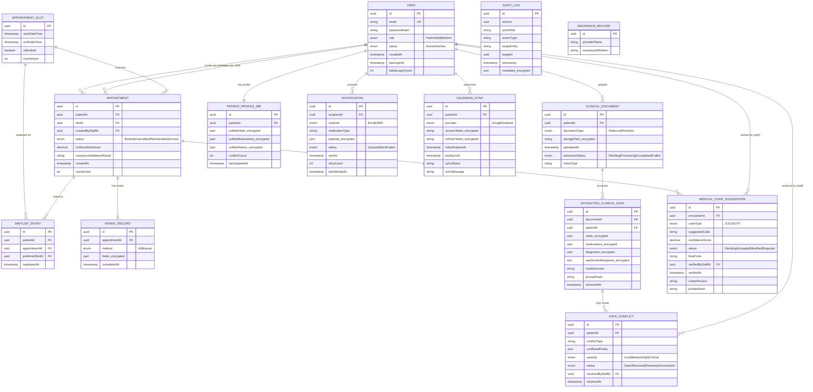
```mermaid
erDiagram
    USER {
        uuid id PK
        string email UK
        string passwordHash
        enum role "Patient|Staff|Admin"
        enum status "Active|Inactive"
        timestamp createdAt
        timestamp lastLoginAt
        int failedLoginCount
    }

    APPOINTMENT_SLOT {
        uuid id PK
        timestamp startDateTime
        timestamp endDateTime
        boolean isBooked
        int rowVersion
    }

    APPOINTMENT {
        uuid id PK
        uuid patientId FK
        uuid slotId FK
        uuid createdByStaffId FK
        enum status "Booked|Cancelled|Rescheduled|Arrived"
        decimal noShowRiskScore
        string insuranceValidationResult
        timestamp createdAt
        int rowVersion
    }

    WAITLIST_ENTRY {
        uuid id PK
        uuid patientId FK
        uuid appointmentId FK
        uuid preferredSlotId FK
        timestamp registeredAt
    }

    INTAKE_RECORD {
        uuid id PK
        uuid appointmentId FK
        enum method "AI|Manual"
        json fields_encrypted
        timestamp completedAt
    }

    CLINICAL_DOCUMENT {
        uuid id PK
        uuid patientId FK
        enum documentType "Historical|PostVisit"
        string storagePath_encrypted
        timestamp uploadedAt
        enum extractionStatus "Pending|Processing|Completed|Failed"
        string mimeType
    }

    EXTRACTED_CLINICAL_DATA {
        uuid id PK
        uuid documentId FK
        uuid patientId FK
        json vitals_encrypted
        json medications_encrypted
        json diagnoses_encrypted
        text rawGeminiResponse_encrypted
        string modelVersion
        string promptHash
        timestamp extractedAt
    }

    PATIENT_PROFILE_360 {
        uuid id PK
        uuid patientId FK
        json unifiedVitals_encrypted
        json unifiedMedications_encrypted
        json unifiedHistory_encrypted
        int conflictCount
        timestamp lastUpdatedAt
    }

    DATA_CONFLICT {
        uuid id PK
        uuid patientId FK
        string conflictType
        json conflictedFields
        enum severity "Low|Medium|High|Critical"
        enum status "Open|Resolved|ReviewedUnresolved"
        uuid resolvedByStaffId FK
        timestamp resolvedAt
    }

    MEDICAL_CODE_SUGGESTION {
        uuid id PK
        uuid encounterId FK
        enum codeType "ICD10|CPT"
        string suggestedCode
        decimal confidenceScore
        enum status "Pending|Accepted|Modified|Rejected"
        string finalCode
        uuid verifiedByStaffId FK
        timestamp verifiedAt
        string modelVersion
        string promptHash
    }

    AUDIT_LOG {
        uuid id PK
        uuid actorId
        string actorRole
        string actionType
        string targetEntity
        uuid targetId
        timestamp timestamp
        json metadata_encrypted
    }

    NOTIFICATION {
        uuid id PK
        uuid recipientId FK
        enum channel "Email|SMS"
        string notificationType
        json payload_encrypted
        enum status "Queued|Sent|Failed"
        timestamp sentAt
        int retryCount
        timestamp lastAttemptAt
    }

    INSURANCE_RECORD {
        uuid id PK
        string providerName
        string insuranceIdPattern
    }

    CALENDAR_SYNC {
        uuid id PK
        uuid patientId FK
        enum provider "Google|Outlook"
        string accessToken_encrypted
        string refreshToken_encrypted
        timestamp tokenExpiresAt
        timestamp lastSyncAt
        string syncStatus
        string errorMessage
    }

    USER ||--o{ APPOINTMENT : "books (as patient)"
    USER ||--o{ APPOINTMENT : "creates (as staff)"
    USER ||--|| PATIENT_PROFILE_360 : "has profile"
    USER ||--o{ CLINICAL_DOCUMENT : "uploads"
    USER ||--o{ CALENDAR_SYNC : "authorises"
    USER ||--o{ NOTIFICATION : "receives"
    APPOINTMENT_SLOT ||--o{ APPOINTMENT : "reserves"
    APPOINTMENT_SLOT ||--o{ WAITLIST_ENTRY : "waitlisted for"
    APPOINTMENT ||--o| INTAKE_RECORD : "has intake"
    APPOINTMENT ||--o{ WAITLIST_ENTRY : "linked to"
    APPOINTMENT ||--o{ MEDICAL_CODE_SUGGESTION : "has suggestions"
    CLINICAL_DOCUMENT ||--o{ EXTRACTED_CLINICAL_DATA : "produces"
    EXTRACTED_CLINICAL_DATA ||--o{ DATA_CONFLICT : "may create"
    DATA_CONFLICT }o--|| USER : "resolved by (staff)"
    MEDICAL_CODE_SUGGESTION }o--|| USER : "verified by (staff)"
```

---

### AI Architecture Diagrams

#### AI Sequence Diagram — UC-009 AI Conversational Intake

<!-- RENDER type="mermaid" src="./uml-models/ai-seq-uc-009.png" -->

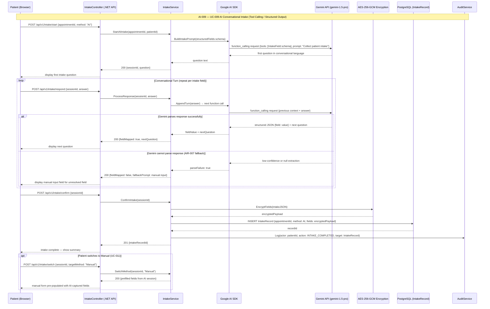
```mermaid
sequenceDiagram
    participant P as Patient (Browser)
    participant API as IntakeController (.NET API)
    participant INTAKE as IntakeService
    participant AI as Google AI SDK
    participant GEMINI as Gemini API (gemini-1.5-pro)
    participant ENC as AES-256-GCM Encryption
    participant DB as PostgreSQL (IntakeRecord)
    participant AUDIT as AuditService

    Note over P,AUDIT: AI-009 — UC-009 AI Conversational Intake (Tool Calling / Structured Output)

    P->>API: POST /api/v1/intake/start {appointmentId, method: "AI"}
    API->>INTAKE: StartAIIntake(appointmentId, patientId)
    INTAKE->>AI: BuildIntakePrompt(structuredFields schema)
    AI->>GEMINI: function_calling request {tools: [IntakeField schema], prompt: "Collect patient intake"}
    GEMINI-->>AI: first question in conversational language
    AI-->>INTAKE: question text
    INTAKE-->>API: 200 {sessionId, question}
    API-->>P: display first intake question

    loop Conversational Turn (repeat per intake field)
        P->>API: POST /api/v1/intake/respond {sessionId, answer}
        API->>INTAKE: ProcessResponse(sessionId, answer)
        INTAKE->>AI: AppendTurn(answer) → next function call
        AI->>GEMINI: function_calling request {previous context + answer}
        alt Gemini parses response successfully
            GEMINI-->>AI: structured JSON {field: value} + next question
            AI-->>INTAKE: fieldValue + nextQuestion
            INTAKE-->>API: 200 {fieldMapped: true, nextQuestion}
            API-->>P: display next question
        else Gemini cannot parse response (AIR-007 fallback)
            GEMINI-->>AI: low-confidence or null extraction
            AI-->>INTAKE: parseFailure: true
            INTAKE-->>API: 200 {fieldMapped: false, fallbackPrompt: manual input}
            API-->>P: display manual input field for unresolved field
        end
    end

    P->>API: POST /api/v1/intake/confirm {sessionId}
    API->>INTAKE: ConfirmIntake(sessionId)
    INTAKE->>ENC: EncryptFields(intakeJSON)
    ENC-->>INTAKE: encryptedPayload
    INTAKE->>DB: INSERT IntakeRecord {appointmentId, method: AI, fields: encryptedPayload}
    DB-->>INTAKE: recordId
    INTAKE->>AUDIT: Log(actor: patientId, action: INTAKE_COMPLETED, target: IntakeRecord)
    INTAKE-->>API: 201 {intakeRecordId}
    API-->>P: intake complete — show summary

    opt Patient switches to Manual (UC-011)
        P->>API: POST /api/v1/intake/switch {sessionId, targetMethod: "Manual"}
        API->>INTAKE: SwitchMethod(sessionId, "Manual")
        INTAKE-->>API: 200 {prefilled fields from AI session}
        API-->>P: manual form pre-populated with AI-captured fields
    end
```

---

#### AI Sequence Diagram — UC-021 AI Clinical Data Extraction

<!-- RENDER type="mermaid" src="./uml-models/ai-seq-uc-021.png" -->

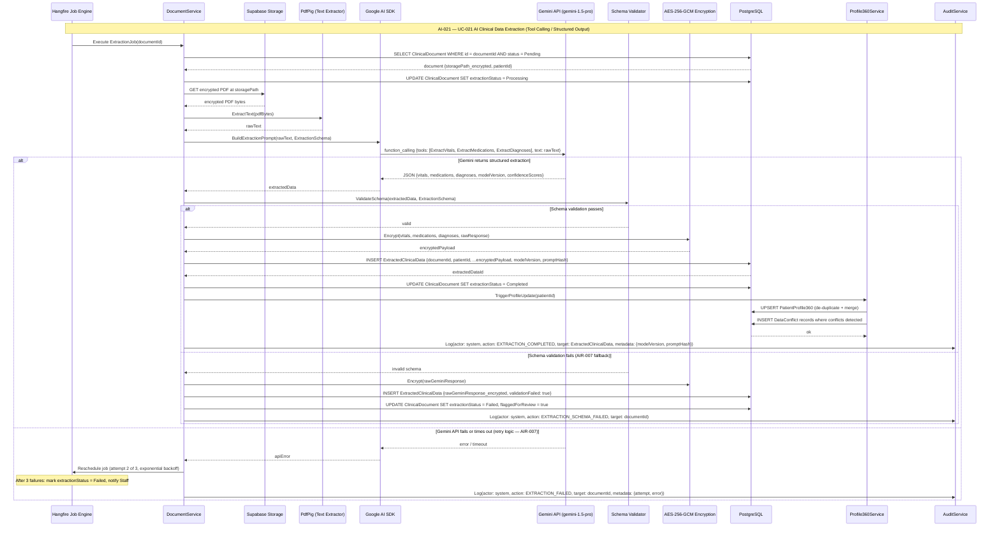
```mermaid
sequenceDiagram
    participant HF as Hangfire Job Engine
    participant DOC_SVC as DocumentService
    participant BLOB as Supabase Storage
    participant PDFPIG as PdfPig (Text Extractor)
    participant AI as Google AI SDK
    participant GEMINI as Gemini API (gemini-1.5-pro)
    participant VALIDATE as Schema Validator
    participant ENC as AES-256-GCM Encryption
    participant DB as PostgreSQL
    participant PROFILE as Profile360Service
    participant AUDIT as AuditService

    Note over HF,AUDIT: AI-021 — UC-021 AI Clinical Data Extraction (Tool Calling / Structured Output)

    HF->>DOC_SVC: Execute ExtractionJob(documentId)
    DOC_SVC->>DB: SELECT ClinicalDocument WHERE id = documentId AND status = Pending
    DB-->>DOC_SVC: document {storagePath_encrypted, patientId}
    DOC_SVC->>DB: UPDATE ClinicalDocument SET extractionStatus = Processing
    DOC_SVC->>BLOB: GET encrypted PDF at storagePath
    BLOB-->>DOC_SVC: encrypted PDF bytes
    DOC_SVC->>PDFPIG: ExtractText(pdfBytes)
    PDFPIG-->>DOC_SVC: rawText

    DOC_SVC->>AI: BuildExtractionPrompt(rawText, ExtractionSchema)
    AI->>GEMINI: function_calling {tools: [ExtractVitals, ExtractMedications, ExtractDiagnoses], text: rawText}

    alt Gemini returns structured extraction
        GEMINI-->>AI: JSON {vitals, medications, diagnoses, modelVersion, confidenceScores}
        AI-->>DOC_SVC: extractedData
        DOC_SVC->>VALIDATE: ValidateSchema(extractedData, ExtractionSchema)
        alt Schema validation passes
            VALIDATE-->>DOC_SVC: valid
            DOC_SVC->>ENC: Encrypt(vitals, medications, diagnoses, rawResponse)
            ENC-->>DOC_SVC: encryptedPayload
            DOC_SVC->>DB: INSERT ExtractedClinicalData {documentId, patientId, ...encryptedPayload, modelVersion, promptHash}
            DB-->>DOC_SVC: extractedDataId
            DOC_SVC->>DB: UPDATE ClinicalDocument SET extractionStatus = Completed
            DOC_SVC->>PROFILE: TriggerProfileUpdate(patientId)
            PROFILE->>DB: UPSERT PatientProfile360 (de-duplicate + merge)
            PROFILE->>DB: INSERT DataConflict records where conflicts detected
            DB-->>PROFILE: ok
            DOC_SVC->>AUDIT: Log(actor: system, action: EXTRACTION_COMPLETED, target: ExtractedClinicalData, metadata: {modelVersion, promptHash})
        else Schema validation fails (AIR-007 fallback)
            VALIDATE-->>DOC_SVC: invalid schema
            DOC_SVC->>ENC: Encrypt(rawGeminiResponse)
            DOC_SVC->>DB: INSERT ExtractedClinicalData {rawGeminiResponse_encrypted, validationFailed: true}
            DOC_SVC->>DB: UPDATE ClinicalDocument SET extractionStatus = Failed, flaggedForReview = true
            DOC_SVC->>AUDIT: Log(actor: system, action: EXTRACTION_SCHEMA_FAILED, target: documentId)
        end
    else Gemini API fails or times out (retry logic — AIR-007)
        GEMINI-->>AI: error / timeout
        AI-->>DOC_SVC: apiError
        DOC_SVC->>HF: Reschedule job (attempt 2 of 3, exponential backoff)
        Note over HF: After 3 failures: mark extractionStatus = Failed, notify Staff
        DOC_SVC->>AUDIT: Log(actor: system, action: EXTRACTION_FAILED, target: documentId, metadata: {attempt, error})
    end
```

---

#### AI Sequence Diagram — UC-023 AI Medical Code Suggestion

<!-- RENDER type="mermaid" src="./uml-models/ai-seq-uc-023.png" -->

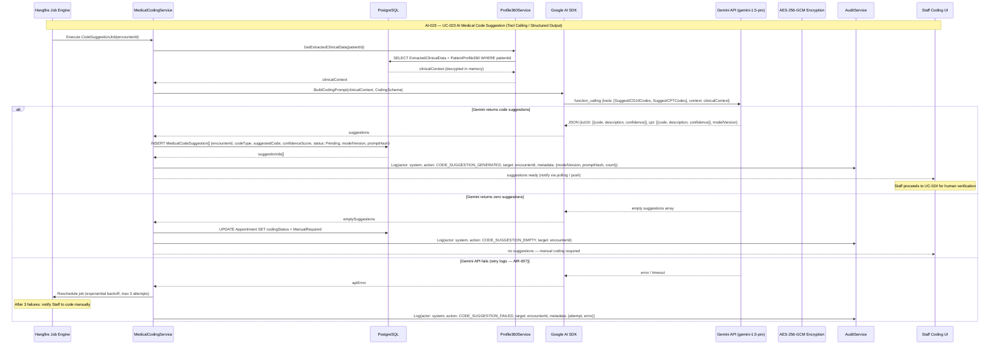
```mermaid
sequenceDiagram
    participant HF as Hangfire Job Engine
    participant CODE_SVC as MedicalCodingService
    participant DB as PostgreSQL
    participant PROFILE as Profile360Service
    participant AI as Google AI SDK
    participant GEMINI as Gemini API (gemini-1.5-pro)
    participant ENC as AES-256-GCM Encryption
    participant AUDIT as AuditService
    participant STAFF_UI as Staff Coding UI

    Note over HF,STAFF_UI: AI-023 — UC-023 AI Medical Code Suggestion (Tool Calling / Structured Output)

    HF->>CODE_SVC: Execute CodeSuggestionJob(encounterId)
    CODE_SVC->>PROFILE: GetExtractedClinicalData(patientId)
    PROFILE->>DB: SELECT ExtractedClinicalData + PatientProfile360 WHERE patientId
    DB-->>PROFILE: clinicalContext (decrypted in memory)
    PROFILE-->>CODE_SVC: clinicalContext

    CODE_SVC->>AI: BuildCodingPrompt(clinicalContext, CodingSchema)
    AI->>GEMINI: function_calling {tools: [SuggestICD10Codes, SuggestCPTCodes], context: clinicalContext}

    alt Gemini returns code suggestions
        GEMINI-->>AI: JSON {icd10: [{code, description, confidence}], cpt: [{code, description, confidence}], modelVersion}
        AI-->>CODE_SVC: suggestions
        CODE_SVC->>DB: INSERT MedicalCodeSuggestion[] {encounterId, codeType, suggestedCode, confidenceScore, status: Pending, modelVersion, promptHash}
        DB-->>CODE_SVC: suggestionIds[]
        CODE_SVC->>AUDIT: Log(actor: system, action: CODE_SUGGESTION_GENERATED, target: encounterId, metadata: {modelVersion, promptHash, count})
        CODE_SVC-->>STAFF_UI: suggestions ready (notify via polling / push)
        Note over STAFF_UI: Staff proceeds to UC-024 for human verification
    else Gemini returns zero suggestions
        GEMINI-->>AI: empty suggestions array
        AI-->>CODE_SVC: emptySuggestions
        CODE_SVC->>DB: UPDATE Appointment SET codingStatus = ManualRequired
        CODE_SVC->>AUDIT: Log(actor: system, action: CODE_SUGGESTION_EMPTY, target: encounterId)
        CODE_SVC-->>STAFF_UI: no suggestions — manual coding required
    else Gemini API fails (retry logic — AIR-007)
        GEMINI-->>AI: error / timeout
        AI-->>CODE_SVC: apiError
        CODE_SVC->>HF: Reschedule job (exponential backoff, max 3 attempts)
        Note over HF: After 3 failures: notify Staff to code manually
        CODE_SVC->>AUDIT: Log(actor: system, action: CODE_SUGGESTION_FAILED, target: encounterId, metadata: {attempt, error})
    end
```

---

## Use Case Sequence Diagrams

### UC-001: Patient Self-Registration

**Source:** `spec.md#UC-001`

<!-- RENDER type="mermaid" src="./uml-models/seq-uc-001.png" -->

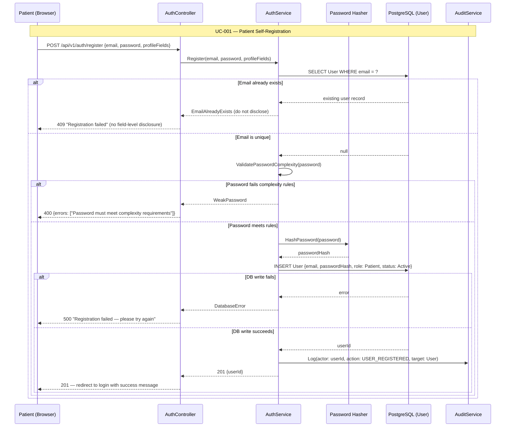
```mermaid
sequenceDiagram
    participant P as Patient (Browser)
    participant API as AuthController
    participant AUTH as AuthService
    participant ENC as Password Hasher
    participant DB as PostgreSQL (User)
    participant AUDIT as AuditService

    Note over P,AUDIT: UC-001 — Patient Self-Registration

    P->>API: POST /api/v1/auth/register {email, password, profileFields}
    API->>AUTH: Register(email, password, profileFields)
    AUTH->>DB: SELECT User WHERE email = ?
    alt Email already exists
        DB-->>AUTH: existing user record
        AUTH-->>API: EmailAlreadyExists (do not disclose)
        API-->>P: 409 "Registration failed" (no field-level disclosure)
    else Email is unique
        DB-->>AUTH: null
        AUTH->>AUTH: ValidatePasswordComplexity(password)
        alt Password fails complexity rules
            AUTH-->>API: WeakPassword
            API-->>P: 400 {errors: ["Password must meet complexity requirements"]}
        else Password meets rules
            AUTH->>ENC: HashPassword(password)
            ENC-->>AUTH: passwordHash
            AUTH->>DB: INSERT User {email, passwordHash, role: Patient, status: Active}
            alt DB write fails
                DB-->>AUTH: error
                AUTH-->>API: DatabaseError
                API-->>P: 500 "Registration failed — please try again"
            else DB write succeeds
                DB-->>AUTH: userId
                AUTH->>AUDIT: Log(actor: userId, action: USER_REGISTERED, target: User)
                AUTH-->>API: 201 {userId}
                API-->>P: 201 — redirect to login with success message
            end
        end
    end
```

---

### UC-002: Patient Login

**Source:** `spec.md#UC-002`

<!-- RENDER type="mermaid" src="./uml-models/seq-uc-002.png" -->

```mermaid
sequenceDiagram
    participant U as User (Patient/Staff/Admin)
    participant API as AuthController
    participant AUTH as AuthService
    participant REDIS as Upstash Redis (Session)
    participant DB as PostgreSQL (User)
    participant AUDIT as AuditService

    Note over U,AUDIT: UC-002 — Patient Login

    U->>API: POST /api/v1/auth/login {email, password}
    API->>AUTH: Login(email, password)
    AUTH->>DB: SELECT User WHERE email = ?
    alt User not found or deactivated
        DB-->>AUTH: null or inactive
        AUTH->>DB: IncrementFailedAttempt(email) if user exists
        AUTH-->>API: InvalidCredentials (generic)
        API-->>U: 401 "Invalid email or password"
    else User found and active
        DB-->>AUTH: user {passwordHash, role, failedLoginCount}
        AUTH->>AUTH: VerifyPassword(password, passwordHash)
        alt Password incorrect
            AUTH->>DB: IncrementFailedAttempt(userId)
            DB-->>AUTH: updatedCount
            alt Failed attempts exceed threshold
                AUTH->>DB: LockAccount(userId, lockUntil)
                AUTH->>AUTH: SendLockNotification(email)
                AUTH-->>API: AccountLocked
                API-->>U: 403 "Account locked — check your email"
            else Under threshold
                AUTH-->>API: InvalidCredentials
                API-->>U: 401 "Invalid email or password"
            end
        else Password correct
            AUTH->>DB: ResetFailedAttempts(userId)
            AUTH->>AUTH: GenerateJWT(userId, role)
            AUTH->>REDIS: SET session:{userId} = {jwtId, expiresAt = now+15min}
            REDIS-->>AUTH: ok
            AUTH->>AUDIT: Log(actor: userId, action: USER_LOGIN, target: User)
            AUTH-->>API: 200 {jwt, role}
            API-->>U: 200 Set-Cookie: jwt=...; HttpOnly; Secure; SameSite=Strict
            Note over U: redirect to role-specific dashboard
        end
    end
```

---

### UC-003: Session Timeout

**Source:** `spec.md#UC-003`

<!-- RENDER type="mermaid" src="./uml-models/seq-uc-003.png" -->

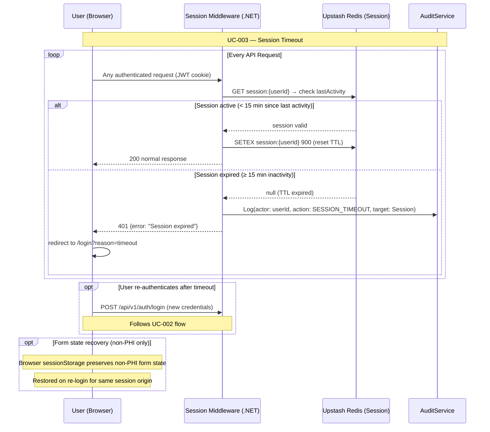
```mermaid
sequenceDiagram
    participant U as User (Browser)
    participant API as Session Middleware (.NET)
    participant REDIS as Upstash Redis (Session)
    participant AUDIT as AuditService

    Note over U,AUDIT: UC-003 — Session Timeout

    loop Every API Request
        U->>API: Any authenticated request (JWT cookie)
        API->>REDIS: GET session:{userId} → check lastActivity
        alt Session active (< 15 min since last activity)
            REDIS-->>API: session valid
            API->>REDIS: SETEX session:{userId} 900 (reset TTL)
            API-->>U: 200 normal response
        else Session expired (≥ 15 min inactivity)
            REDIS-->>API: null (TTL expired)
            API->>AUDIT: Log(actor: userId, action: SESSION_TIMEOUT, target: Session)
            API-->>U: 401 {error: "Session expired"}
            U->>U: redirect to /login?reason=timeout
        end
    end

    opt User re-authenticates after timeout
        U->>API: POST /api/v1/auth/login (new credentials)
        Note over U,API: Follows UC-002 flow
    end

    opt Form state recovery (non-PHI only)
        Note over U: Browser sessionStorage preserves non-PHI form state
        Note over U: Restored on re-login for same session origin
    end
```

---

### UC-004: Book an Appointment

**Source:** `spec.md#UC-004`

<!-- RENDER type="mermaid" src="./uml-models/seq-uc-004.png" -->

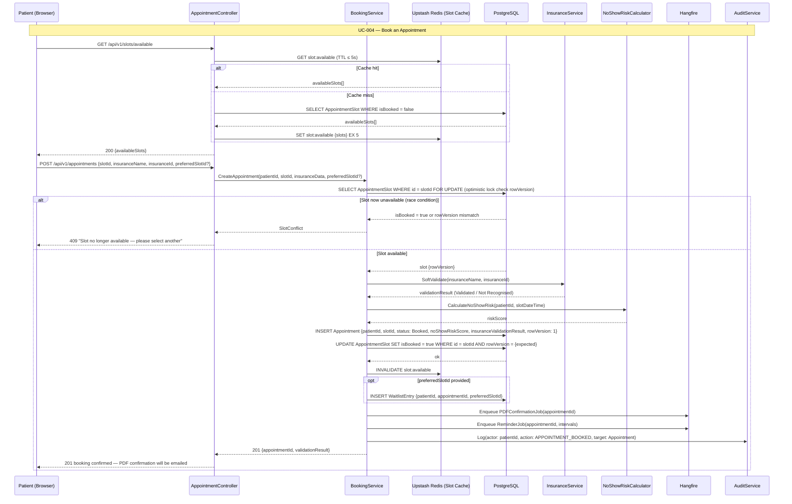
```mermaid
sequenceDiagram
    participant P as Patient (Browser)
    participant API as AppointmentController
    participant BOOK as BookingService
    participant REDIS as Upstash Redis (Slot Cache)
    participant DB as PostgreSQL
    participant INS as InsuranceService
    participant RISK as NoShowRiskCalculator
    participant HF as Hangfire
    participant AUDIT as AuditService

    Note over P,AUDIT: UC-004 — Book an Appointment

    P->>API: GET /api/v1/slots/available
    API->>REDIS: GET slot:available (TTL ≤ 5s)
    alt Cache hit
        REDIS-->>API: availableSlots[]
    else Cache miss
        API->>DB: SELECT AppointmentSlot WHERE isBooked = false
        DB-->>API: availableSlots[]
        API->>REDIS: SET slot:available {slots} EX 5
    end
    API-->>P: 200 {availableSlots}

    P->>API: POST /api/v1/appointments {slotId, insuranceName, insuranceId, preferredSlotId?}
    API->>BOOK: CreateAppointment(patientId, slotId, insuranceData, preferredSlotId?)
    BOOK->>DB: SELECT AppointmentSlot WHERE id = slotId FOR UPDATE (optimistic lock check rowVersion)
    alt Slot now unavailable (race condition)
        DB-->>BOOK: isBooked = true or rowVersion mismatch
        BOOK-->>API: SlotConflict
        API-->>P: 409 "Slot no longer available — please select another"
    else Slot available
        DB-->>BOOK: slot {rowVersion}
        BOOK->>INS: SoftValidate(insuranceName, insuranceId)
        INS-->>BOOK: validationResult (Validated / Not Recognised)
        BOOK->>RISK: CalculateNoShowRisk(patientId, slotDateTime)
        RISK-->>BOOK: riskScore
        BOOK->>DB: INSERT Appointment {patientId, slotId, status: Booked, noShowRiskScore, insuranceValidationResult, rowVersion: 1}
        BOOK->>DB: UPDATE AppointmentSlot SET isBooked = true WHERE id = slotId AND rowVersion = {expected}
        DB-->>BOOK: ok
        BOOK->>REDIS: INVALIDATE slot:available
        opt preferredSlotId provided
            BOOK->>DB: INSERT WaitlistEntry {patientId, appointmentId, preferredSlotId}
        end
        BOOK->>HF: Enqueue PDFConfirmationJob(appointmentId)
        BOOK->>HF: Enqueue ReminderJob(appointmentId, intervals)
        BOOK->>AUDIT: Log(actor: patientId, action: APPOINTMENT_BOOKED, target: Appointment)
        BOOK-->>API: 201 {appointmentId, validationResult}
        API-->>P: 201 booking confirmed — PDF confirmation will be emailed
    end
```

---

### UC-005: Cancel an Appointment

**Source:** `spec.md#UC-005`

<!-- RENDER type="mermaid" src="./uml-models/seq-uc-005.png" -->

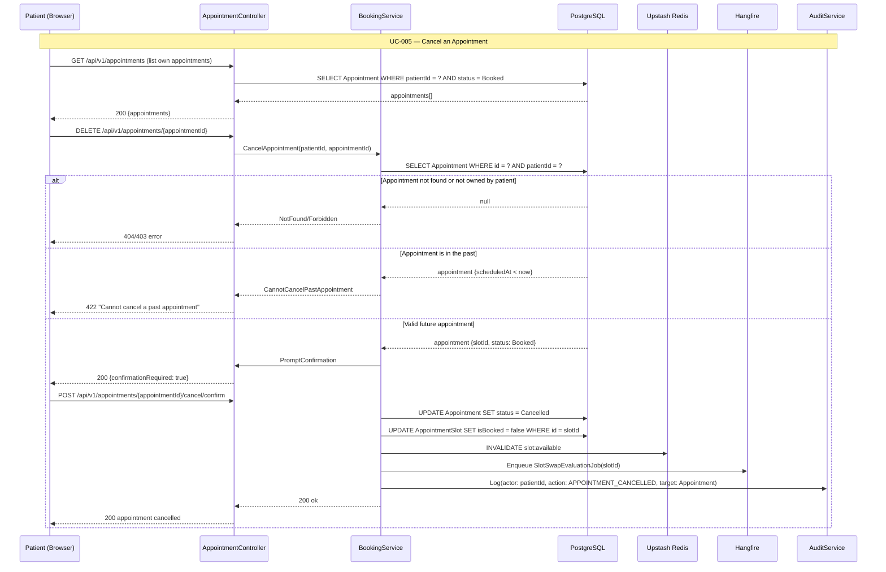
```mermaid
sequenceDiagram
    participant P as Patient (Browser)
    participant API as AppointmentController
    participant BOOK as BookingService
    participant DB as PostgreSQL
    participant REDIS as Upstash Redis
    participant HF as Hangfire
    participant AUDIT as AuditService

    Note over P,AUDIT: UC-005 — Cancel an Appointment

    P->>API: GET /api/v1/appointments (list own appointments)
    API->>DB: SELECT Appointment WHERE patientId = ? AND status = Booked
    DB-->>API: appointments[]
    API-->>P: 200 {appointments}

    P->>API: DELETE /api/v1/appointments/{appointmentId}
    API->>BOOK: CancelAppointment(patientId, appointmentId)
    BOOK->>DB: SELECT Appointment WHERE id = ? AND patientId = ?
    alt Appointment not found or not owned by patient
        DB-->>BOOK: null
        BOOK-->>API: NotFound/Forbidden
        API-->>P: 404/403 error
    else Appointment is in the past
        DB-->>BOOK: appointment {scheduledAt < now}
        BOOK-->>API: CannotCancelPastAppointment
        API-->>P: 422 "Cannot cancel a past appointment"
    else Valid future appointment
        DB-->>BOOK: appointment {slotId, status: Booked}
        BOOK->>API: PromptConfirmation
        API-->>P: 200 {confirmationRequired: true}
        P->>API: POST /api/v1/appointments/{appointmentId}/cancel/confirm
        BOOK->>DB: UPDATE Appointment SET status = Cancelled
        BOOK->>DB: UPDATE AppointmentSlot SET isBooked = false WHERE id = slotId
        BOOK->>REDIS: INVALIDATE slot:available
        BOOK->>HF: Enqueue SlotSwapEvaluationJob(slotId)
        BOOK->>AUDIT: Log(actor: patientId, action: APPOINTMENT_CANCELLED, target: Appointment)
        BOOK-->>API: 200 ok
        API-->>P: 200 appointment cancelled
    end
```

---

### UC-006: Reschedule an Appointment

**Source:** `spec.md#UC-006`

<!-- RENDER type="mermaid" src="./uml-models/seq-uc-006.png" -->

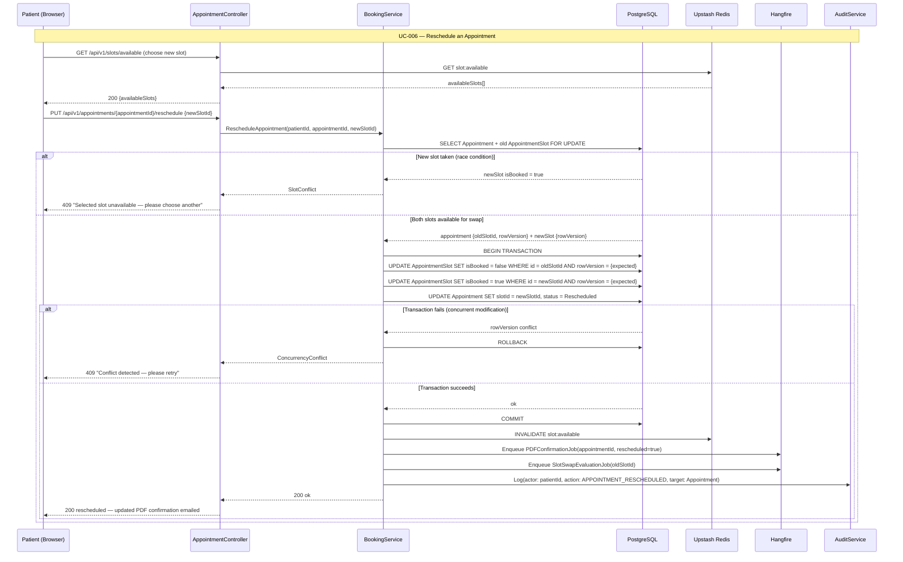
```mermaid
sequenceDiagram
    participant P as Patient (Browser)
    participant API as AppointmentController
    participant BOOK as BookingService
    participant DB as PostgreSQL
    participant REDIS as Upstash Redis
    participant HF as Hangfire
    participant AUDIT as AuditService

    Note over P,AUDIT: UC-006 — Reschedule an Appointment

    P->>API: GET /api/v1/slots/available (choose new slot)
    API->>REDIS: GET slot:available
    REDIS-->>API: availableSlots[]
    API-->>P: 200 {availableSlots}

    P->>API: PUT /api/v1/appointments/{appointmentId}/reschedule {newSlotId}
    API->>BOOK: RescheduleAppointment(patientId, appointmentId, newSlotId)
    BOOK->>DB: SELECT Appointment + old AppointmentSlot FOR UPDATE
    alt New slot taken (race condition)
        DB-->>BOOK: newSlot isBooked = true
        BOOK-->>API: SlotConflict
        API-->>P: 409 "Selected slot unavailable — please choose another"
    else Both slots available for swap
        DB-->>BOOK: appointment {oldSlotId, rowVersion} + newSlot {rowVersion}
        BOOK->>DB: BEGIN TRANSACTION
        BOOK->>DB: UPDATE AppointmentSlot SET isBooked = false WHERE id = oldSlotId AND rowVersion = {expected}
        BOOK->>DB: UPDATE AppointmentSlot SET isBooked = true WHERE id = newSlotId AND rowVersion = {expected}
        BOOK->>DB: UPDATE Appointment SET slotId = newSlotId, status = Rescheduled
        alt Transaction fails (concurrent modification)
            DB-->>BOOK: rowVersion conflict
            BOOK->>DB: ROLLBACK
            BOOK-->>API: ConcurrencyConflict
            API-->>P: 409 "Conflict detected — please retry"
        else Transaction succeeds
            DB-->>BOOK: ok
            BOOK->>DB: COMMIT
            BOOK->>REDIS: INVALIDATE slot:available
            BOOK->>HF: Enqueue PDFConfirmationJob(appointmentId, rescheduled=true)
            BOOK->>HF: Enqueue SlotSwapEvaluationJob(oldSlotId)
            BOOK->>AUDIT: Log(actor: patientId, action: APPOINTMENT_RESCHEDULED, target: Appointment)
            BOOK-->>API: 200 ok
            API-->>P: 200 rescheduled — updated PDF confirmation emailed
        end
    end
```

---

### UC-007: Register Preferred Slot

**Source:** `spec.md#UC-007`

<!-- RENDER type="mermaid" src="./uml-models/seq-uc-007.png" -->

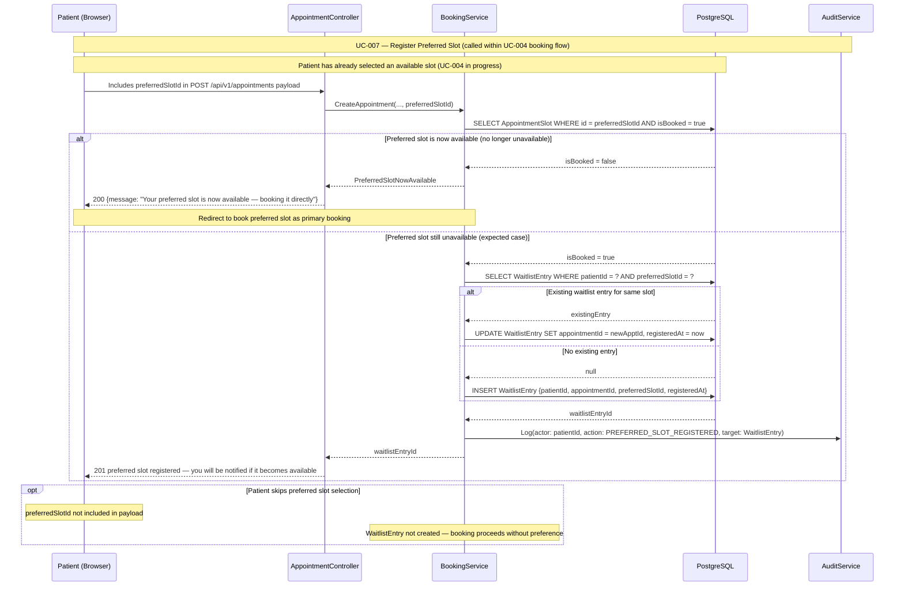
```mermaid
sequenceDiagram
    participant P as Patient (Browser)
    participant API as AppointmentController
    participant BOOK as BookingService
    participant DB as PostgreSQL
    participant AUDIT as AuditService

    Note over P,AUDIT: UC-007 — Register Preferred Slot (called within UC-004 booking flow)

    Note over P,DB: Patient has already selected an available slot (UC-004 in progress)

    P->>API: Includes preferredSlotId in POST /api/v1/appointments payload
    API->>BOOK: CreateAppointment(..., preferredSlotId)
    BOOK->>DB: SELECT AppointmentSlot WHERE id = preferredSlotId AND isBooked = true
    alt Preferred slot is now available (no longer unavailable)
        DB-->>BOOK: isBooked = false
        BOOK-->>API: PreferredSlotNowAvailable
        API-->>P: 200 {message: "Your preferred slot is now available — booking it directly"}
        Note over P,BOOK: Redirect to book preferred slot as primary booking
    else Preferred slot still unavailable (expected case)
        DB-->>BOOK: isBooked = true
        BOOK->>DB: SELECT WaitlistEntry WHERE patientId = ? AND preferredSlotId = ?
        alt Existing waitlist entry for same slot
            DB-->>BOOK: existingEntry
            BOOK->>DB: UPDATE WaitlistEntry SET appointmentId = newApptId, registeredAt = now
        else No existing entry
            DB-->>BOOK: null
            BOOK->>DB: INSERT WaitlistEntry {patientId, appointmentId, preferredSlotId, registeredAt}
        end
        DB-->>BOOK: waitlistEntryId
        BOOK->>AUDIT: Log(actor: patientId, action: PREFERRED_SLOT_REGISTERED, target: WaitlistEntry)
        BOOK-->>API: waitlistEntryId
        API-->>P: 201 preferred slot registered — you will be notified if it becomes available
    end

    opt Patient skips preferred slot selection
        Note over P: preferredSlotId not included in payload
        Note over BOOK: WaitlistEntry not created — booking proceeds without preference
    end
```

---

### UC-008: Automatic Preferred Slot Swap

**Source:** `spec.md#UC-008`

<!-- RENDER type="mermaid" src="./uml-models/seq-uc-008.png" -->

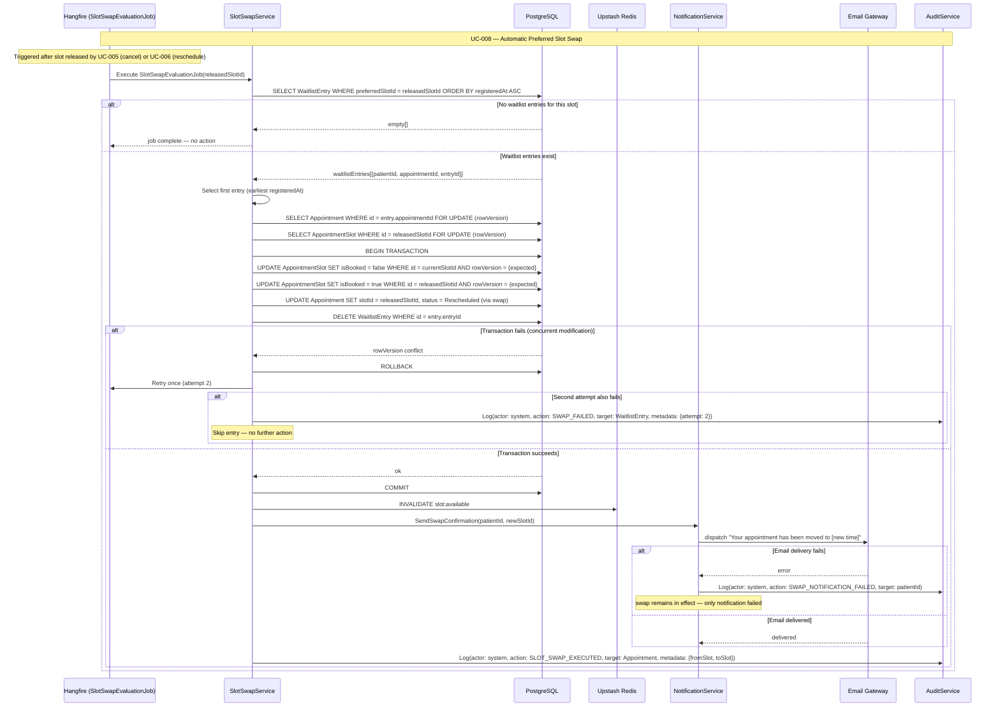
```mermaid
sequenceDiagram
    participant HF as Hangfire (SlotSwapEvaluationJob)
    participant SWAP as SlotSwapService
    participant DB as PostgreSQL
    participant REDIS as Upstash Redis
    participant NOTIFY as NotificationService
    participant EMAIL as Email Gateway
    participant AUDIT as AuditService

    Note over HF,AUDIT: UC-008 — Automatic Preferred Slot Swap

    Note over HF: Triggered after slot released by UC-005 (cancel) or UC-006 (reschedule)

    HF->>SWAP: Execute SlotSwapEvaluationJob(releasedSlotId)
    SWAP->>DB: SELECT WaitlistEntry WHERE preferredSlotId = releasedSlotId ORDER BY registeredAt ASC
    alt No waitlist entries for this slot
        DB-->>SWAP: empty[]
        SWAP-->>HF: job complete — no action
    else Waitlist entries exist
        DB-->>SWAP: waitlistEntries[{patientId, appointmentId, entryId}]
        SWAP->>SWAP: Select first entry (earliest registeredAt)
        SWAP->>DB: SELECT Appointment WHERE id = entry.appointmentId FOR UPDATE (rowVersion)
        SWAP->>DB: SELECT AppointmentSlot WHERE id = releasedSlotId FOR UPDATE (rowVersion)
        SWAP->>DB: BEGIN TRANSACTION
        SWAP->>DB: UPDATE AppointmentSlot SET isBooked = false WHERE id = currentSlotId AND rowVersion = {expected}
        SWAP->>DB: UPDATE AppointmentSlot SET isBooked = true WHERE id = releasedSlotId AND rowVersion = {expected}
        SWAP->>DB: UPDATE Appointment SET slotId = releasedSlotId, status = Rescheduled (via swap)
        SWAP->>DB: DELETE WaitlistEntry WHERE id = entry.entryId
        alt Transaction fails (concurrent modification)
            DB-->>SWAP: rowVersion conflict
            SWAP->>DB: ROLLBACK
            SWAP->>HF: Retry once (attempt 2)
            alt Second attempt also fails
                SWAP->>AUDIT: Log(actor: system, action: SWAP_FAILED, target: WaitlistEntry, metadata: {attempt: 2})
                Note over SWAP: Skip entry — no further action
            end
        else Transaction succeeds
            DB-->>SWAP: ok
            SWAP->>DB: COMMIT
            SWAP->>REDIS: INVALIDATE slot:available
            SWAP->>NOTIFY: SendSwapConfirmation(patientId, newSlotId)
            NOTIFY->>EMAIL: dispatch "Your appointment has been moved to [new time]"
            alt Email delivery fails
                EMAIL-->>NOTIFY: error
                NOTIFY->>AUDIT: Log(actor: system, action: SWAP_NOTIFICATION_FAILED, target: patientId)
                Note over NOTIFY: swap remains in effect — only notification failed
            else Email delivered
                EMAIL-->>NOTIFY: delivered
            end
            SWAP->>AUDIT: Log(actor: system, action: SLOT_SWAP_EXECUTED, target: Appointment, metadata: {fromSlot, toSlot})
        end
    end
```

---

### UC-009: AI Conversational Intake

**Source:** `spec.md#UC-009`

<!-- RENDER type="mermaid" src="./uml-models/seq-uc-009.png" -->

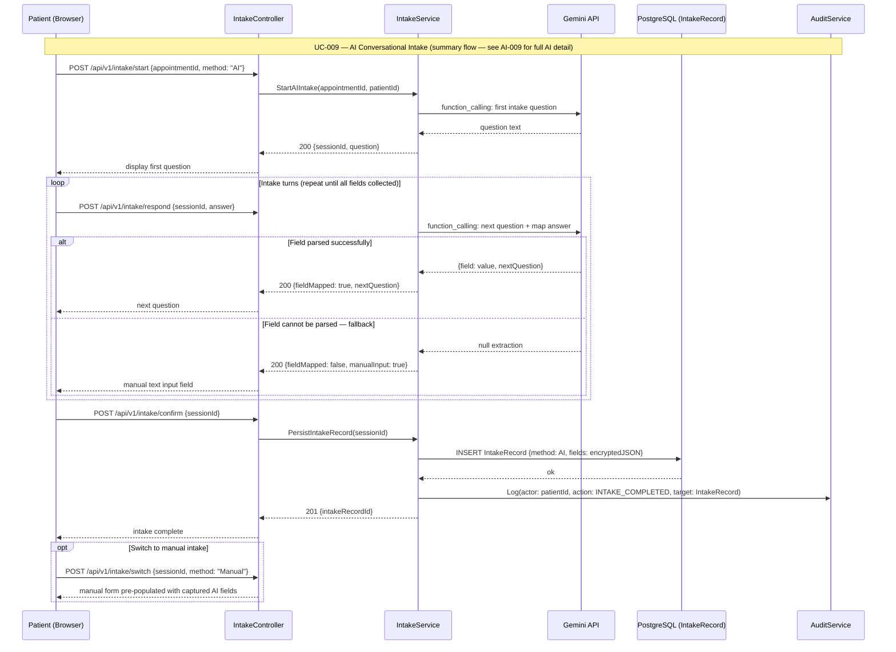
```mermaid
sequenceDiagram
    participant P as Patient (Browser)
    participant API as IntakeController
    participant INTAKE as IntakeService
    participant GEMINI as Gemini API
    participant DB as PostgreSQL (IntakeRecord)
    participant AUDIT as AuditService

    Note over P,AUDIT: UC-009 — AI Conversational Intake (summary flow — see AI-009 for full AI detail)

    P->>API: POST /api/v1/intake/start {appointmentId, method: "AI"}
    API->>INTAKE: StartAIIntake(appointmentId, patientId)
    INTAKE->>GEMINI: function_calling: first intake question
    GEMINI-->>INTAKE: question text
    INTAKE-->>API: 200 {sessionId, question}
    API-->>P: display first question

    loop Intake turns (repeat until all fields collected)
        P->>API: POST /api/v1/intake/respond {sessionId, answer}
        INTAKE->>GEMINI: function_calling: next question + map answer
        alt Field parsed successfully
            GEMINI-->>INTAKE: {field: value, nextQuestion}
            INTAKE-->>API: 200 {fieldMapped: true, nextQuestion}
            API-->>P: next question
        else Field cannot be parsed — fallback
            GEMINI-->>INTAKE: null extraction
            INTAKE-->>API: 200 {fieldMapped: false, manualInput: true}
            API-->>P: manual text input field
        end
    end

    P->>API: POST /api/v1/intake/confirm {sessionId}
    API->>INTAKE: PersistIntakeRecord(sessionId)
    INTAKE->>DB: INSERT IntakeRecord {method: AI, fields: encryptedJSON}
    DB-->>INTAKE: ok
    INTAKE->>AUDIT: Log(actor: patientId, action: INTAKE_COMPLETED, target: IntakeRecord)
    INTAKE-->>API: 201 {intakeRecordId}
    API-->>P: intake complete

    opt Switch to manual intake
        P->>API: POST /api/v1/intake/switch {sessionId, method: "Manual"}
        API-->>P: manual form pre-populated with captured AI fields
    end
```

---

### UC-010: Manual Intake Form

**Source:** `spec.md#UC-010`

<!-- RENDER type="mermaid" src="./uml-models/seq-uc-010.png" -->

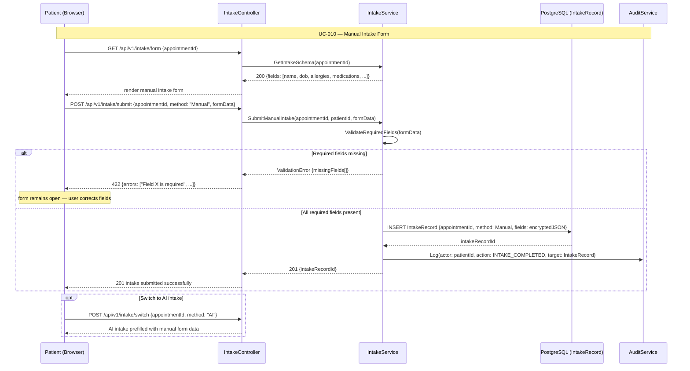
```mermaid
sequenceDiagram
    participant P as Patient (Browser)
    participant API as IntakeController
    participant INTAKE as IntakeService
    participant DB as PostgreSQL (IntakeRecord)
    participant AUDIT as AuditService

    Note over P,AUDIT: UC-010 — Manual Intake Form

    P->>API: GET /api/v1/intake/form {appointmentId}
    API->>INTAKE: GetIntakeSchema(appointmentId)
    INTAKE-->>API: 200 {fields: [name, dob, allergies, medications, ...]}
    API-->>P: render manual intake form

    P->>API: POST /api/v1/intake/submit {appointmentId, method: "Manual", formData}
    API->>INTAKE: SubmitManualIntake(appointmentId, patientId, formData)
    INTAKE->>INTAKE: ValidateRequiredFields(formData)
    alt Required fields missing
        INTAKE-->>API: ValidationError {missingFields[]}
        API-->>P: 422 {errors: ["Field X is required", ...]}
        Note over P: form remains open — user corrects fields
    else All required fields present
        INTAKE->>DB: INSERT IntakeRecord {appointmentId, method: Manual, fields: encryptedJSON}
        DB-->>INTAKE: intakeRecordId
        INTAKE->>AUDIT: Log(actor: patientId, action: INTAKE_COMPLETED, target: IntakeRecord)
        INTAKE-->>API: 201 {intakeRecordId}
        API-->>P: 201 intake submitted successfully
    end

    opt Switch to AI intake
        P->>API: POST /api/v1/intake/switch {appointmentId, method: "AI"}
        API-->>P: AI intake prefilled with manual form data
    end
```

---

### UC-011: Switch Intake Method

**Source:** `spec.md#UC-011`

<!-- RENDER type="mermaid" src="./uml-models/seq-uc-011.png" -->

```mermaid
sequenceDiagram
    participant P as Patient (Browser)
    participant API as IntakeController
    participant INTAKE as IntakeService
    participant DB as PostgreSQL (IntakeSession)

    Note over P,DB: UC-011 — Switch Intake Method

    Note over P: Patient is in an active intake session (AI or Manual)

    P->>API: POST /api/v1/intake/switch {sessionId, targetMethod: "Manual"|"AI"}
    API->>INTAKE: SwitchIntakeMethod(sessionId, targetMethod)
    INTAKE->>DB: SELECT IntakeSession WHERE id = sessionId (get captured fields so far)
    DB-->>INTAKE: capturedFields {fieldName: value}[]
    INTAKE->>INTAKE: MapFieldsToTargetMethod(capturedFields, targetMethod)
    alt All fields map cleanly
        INTAKE-->>API: 200 {prefilledFields: {mappedField: value}[]}
        API-->>P: render target form/chat with pre-populated fields
    else Some fields have no equivalent in target
        INTAKE-->>API: 200 {prefilledFields: [...], unmappedFields: [fieldName][] }
        API-->>P: render target with pre-populated fields; unmapped fields shown as blank manual entry
    end

    P->>API: continue intake in target method
    Note over P,INTAKE: All previously captured data is preserved — no data loss
```

---

### UC-012: Send Appointment Reminder / Notification

**Source:** `spec.md#UC-012`

<!-- RENDER type="mermaid" src="./uml-models/seq-uc-012.png" -->

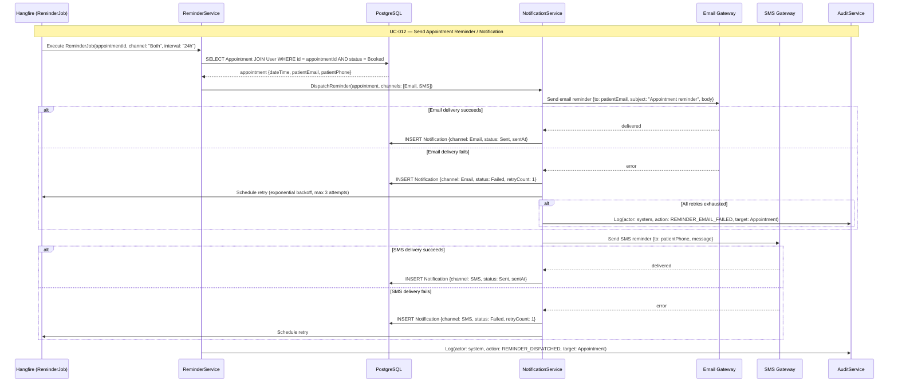
```mermaid
sequenceDiagram
    participant HF as Hangfire (ReminderJob)
    participant REMIND as ReminderService
    participant DB as PostgreSQL
    participant NOTIFY as NotificationService
    participant EMAIL as Email Gateway
    participant SMS as SMS Gateway
    participant AUDIT as AuditService

    Note over HF,AUDIT: UC-012 — Send Appointment Reminder / Notification

    HF->>REMIND: Execute ReminderJob(appointmentId, channel: "Both", interval: "24h")
    REMIND->>DB: SELECT Appointment JOIN User WHERE id = appointmentId AND status = Booked
    DB-->>REMIND: appointment {dateTime, patientEmail, patientPhone}
    REMIND->>NOTIFY: DispatchReminder(appointment, channels: [Email, SMS])

    NOTIFY->>EMAIL: Send email reminder {to: patientEmail, subject: "Appointment reminder", body}
    alt Email delivery succeeds
        EMAIL-->>NOTIFY: delivered
        NOTIFY->>DB: INSERT Notification {channel: Email, status: Sent, sentAt}
    else Email delivery fails
        EMAIL-->>NOTIFY: error
        NOTIFY->>DB: INSERT Notification {channel: Email, status: Failed, retryCount: 1}
        NOTIFY->>HF: Schedule retry (exponential backoff, max 3 attempts)
        alt All retries exhausted
            NOTIFY->>AUDIT: Log(actor: system, action: REMINDER_EMAIL_FAILED, target: Appointment)
        end
    end

    NOTIFY->>SMS: Send SMS reminder {to: patientPhone, message}
    alt SMS delivery succeeds
        SMS-->>NOTIFY: delivered
        NOTIFY->>DB: INSERT Notification {channel: SMS, status: Sent, sentAt}
    else SMS delivery fails
        SMS-->>NOTIFY: error
        NOTIFY->>DB: INSERT Notification {channel: SMS, status: Failed, retryCount: 1}
        NOTIFY->>HF: Schedule retry
    end

    REMIND->>AUDIT: Log(actor: system, action: REMINDER_DISPATCHED, target: Appointment)
```

---

### UC-013: Sync Appointment to Calendar

**Source:** `spec.md#UC-013`

<!-- RENDER type="mermaid" src="./uml-models/seq-uc-013.png" -->

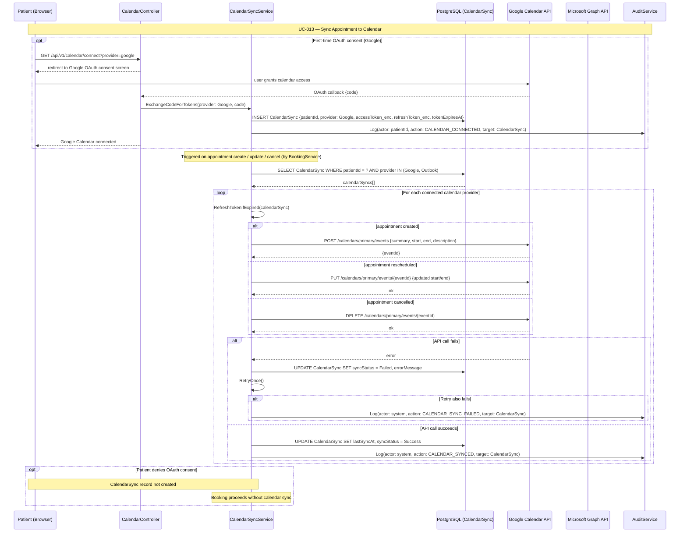
```mermaid
sequenceDiagram
    participant P as Patient (Browser)
    participant API as CalendarController
    participant CAL as CalendarSyncService
    participant DB as PostgreSQL (CalendarSync)
    participant GCAL as Google Calendar API
    participant OUTLOOK as Microsoft Graph API
    participant AUDIT as AuditService

    Note over P,AUDIT: UC-013 — Sync Appointment to Calendar

    opt First-time OAuth consent (Google)
        P->>API: GET /api/v1/calendar/connect?provider=google
        API-->>P: redirect to Google OAuth consent screen
        P->>GCAL: user grants calendar access
        GCAL-->>API: OAuth callback {code}
        API->>CAL: ExchangeCodeForTokens(provider: Google, code)
        CAL->>DB: INSERT CalendarSync {patientId, provider: Google, accessToken_enc, refreshToken_enc, tokenExpiresAt}
        CAL->>AUDIT: Log(actor: patientId, action: CALENDAR_CONNECTED, target: CalendarSync)
        API-->>P: Google Calendar connected
    end

    Note over CAL: Triggered on appointment create / update / cancel (by BookingService)

    CAL->>DB: SELECT CalendarSync WHERE patientId = ? AND provider IN (Google, Outlook)
    DB-->>CAL: calendarSyncs[]

    loop For each connected calendar provider
        CAL->>CAL: RefreshTokenIfExpired(calendarSync)
        alt appointment created
            CAL->>GCAL: POST /calendars/primary/events {summary, start, end, description}
            GCAL-->>CAL: {eventId}
        else appointment rescheduled
            CAL->>GCAL: PUT /calendars/primary/events/{eventId} {updated start/end}
            GCAL-->>CAL: ok
        else appointment cancelled
            CAL->>GCAL: DELETE /calendars/primary/events/{eventId}
            GCAL-->>CAL: ok
        end
        alt API call fails
            GCAL-->>CAL: error
            CAL->>DB: UPDATE CalendarSync SET syncStatus = Failed, errorMessage
            CAL->>CAL: RetryOnce()
            alt Retry also fails
                CAL->>AUDIT: Log(actor: system, action: CALENDAR_SYNC_FAILED, target: CalendarSync)
            end
        else API call succeeds
            CAL->>DB: UPDATE CalendarSync SET lastSyncAt, syncStatus = Success
            CAL->>AUDIT: Log(actor: system, action: CALENDAR_SYNCED, target: CalendarSync)
        end
    end

    opt Patient denies OAuth consent
        Note over P,CAL: CalendarSync record not created
        Note over CAL: Booking proceeds without calendar sync
    end
```

---

### UC-014: Staff Walk-in Booking

**Source:** `spec.md#UC-014`

<!-- RENDER type="mermaid" src="./uml-models/seq-uc-014.png" -->

```mermaid
sequenceDiagram
    participant S as Staff (Browser)
    participant API as StaffController
    participant STAFF_SVC as StaffService
    participant BOOK as BookingService
    participant DB as PostgreSQL
    participant REDIS as Upstash Redis
    participant AUDIT as AuditService

    Note over S,AUDIT: UC-014 — Staff Walk-in Booking

    S->>API: GET /api/v1/slots/available
    API->>REDIS: GET slot:available
    REDIS-->>API: availableSlots[]
    API-->>S: 200 {availableSlots}

    S->>API: POST /api/v1/staff/walkin-booking {patientSearch?, newPatientDetails?, slotId, createAccount?}
    API->>STAFF_SVC: CreateWalkInBooking(staffId, payload)

    alt Existing patient found
        STAFF_SVC->>DB: SELECT User WHERE email = patientEmail OR name LIKE ?
        DB-->>STAFF_SVC: existingPatient {userId}
    else New patient — anonymous booking
        STAFF_SVC->>DB: INSERT User {anonymousPatient = true} or proceed without User record
        DB-->>STAFF_SVC: patientId (or null for anonymous)
    end

    STAFF_SVC->>BOOK: CreateAppointment(patientId, slotId, createdByStaffId)
    BOOK->>DB: SELECT AppointmentSlot WHERE id = slotId FOR UPDATE
    alt Slot unavailable
        DB-->>BOOK: isBooked = true
        BOOK-->>API: SlotConflict
        API-->>S: 409 "Slot unavailable — place patient in same-day queue instead"
    else Slot available
        BOOK->>DB: INSERT Appointment {patientId, slotId, createdByStaffId, status: Booked}
        BOOK->>DB: UPDATE AppointmentSlot SET isBooked = true
        BOOK->>REDIS: INVALIDATE slot:available
        opt Create patient account (FR-023)
            STAFF_SVC->>DB: INSERT User {email, role: Patient, createdByStaff: true}
            DB-->>STAFF_SVC: newUserId
            STAFF_SVC->>DB: UPDATE Appointment SET patientId = newUserId
        end
        STAFF_SVC->>AUDIT: Log(actor: staffId, action: WALKIN_APPOINTMENT_BOOKED, target: Appointment)
        STAFF_SVC-->>API: 201 {appointmentId}
        API-->>S: 201 walk-in appointment created
    end
```

---

### UC-015: Manage Same-Day Queue

**Source:** `spec.md#UC-015`

<!-- RENDER type="mermaid" src="./uml-models/seq-uc-015.png" -->

```mermaid
sequenceDiagram
    participant S as Staff (Browser)
    participant API as StaffController
    participant QUEUE as QueueService
    participant DB as PostgreSQL
    participant AUDIT as AuditService

    Note over S,AUDIT: UC-015 — Manage Same-Day Queue

    S->>API: GET /api/v1/staff/queue/today
    API->>QUEUE: GetTodayQueue(today)
    QUEUE->>DB: SELECT Appointment WHERE DATE(startDateTime) = today ORDER BY startDateTime ASC
    DB-->>QUEUE: appointments[] with status indicators
    QUEUE-->>API: 200 {queueEntries[]}
    API-->>S: render same-day queue dashboard

    opt Reorder queue entries
        S->>API: PUT /api/v1/staff/queue/reorder {appointmentId, newPosition}
        API->>QUEUE: ReorderQueue(appointmentId, newPosition)
        QUEUE->>DB: UPDATE Appointment SET queuePosition = newPosition
        alt Reorder conflicts with slot constraint
            QUEUE-->>API: SlotConstraintWarning
            API-->>S: 200 {warning: "Reorder conflicts with slot time — proceed?"}
            S->>API: POST /api/v1/staff/queue/reorder/confirm {force: true}
            QUEUE->>DB: UPDATE Appointment SET queuePosition = newPosition (override)
        else Reorder accepted
            DB-->>QUEUE: ok
        end
        QUEUE->>AUDIT: Log(actor: staffId, action: QUEUE_REORDERED, target: Appointment)
        API-->>S: 200 queue updated
    end

    opt Remove patient from queue
        S->>API: DELETE /api/v1/staff/queue/{appointmentId} {reason}
        API->>QUEUE: RemoveFromQueue(staffId, appointmentId, reason)
        QUEUE->>DB: UPDATE Appointment SET status = Removed, removalReason = reason
        QUEUE->>AUDIT: Log(actor: staffId, action: PATIENT_REMOVED_FROM_QUEUE, target: Appointment, metadata: {reason})
        QUEUE-->>API: 200 ok
        API-->>S: 200 patient removed from queue
    end
```

---

### UC-016: Mark Patient Arrived

**Source:** `spec.md#UC-016`

<!-- RENDER type="mermaid" src="./uml-models/seq-uc-016.png" -->

```mermaid
sequenceDiagram
    participant S as Staff (Browser)
    participant P as Patient (Browser — blocked)
    participant API as StaffController
    participant RBAC as RBAC Middleware
    participant ARRIVE as ArrivalService
    participant DB as PostgreSQL
    participant AUDIT as AuditService

    Note over S,AUDIT: UC-016 — Mark Patient Arrived

    S->>API: POST /api/v1/staff/appointments/{appointmentId}/arrive
    API->>RBAC: CheckRole(actor: Staff)
    RBAC-->>API: authorised
    API->>ARRIVE: MarkArrived(staffId, appointmentId)
    ARRIVE->>DB: SELECT Appointment WHERE id = ? AND DATE(startDateTime) = today
    alt Appointment not found
        DB-->>ARRIVE: null
        ARRIVE-->>API: NotFound
        API-->>S: 404 — search by patient name/ID
    else Appointment found
        DB-->>ARRIVE: appointment {status}
        ARRIVE->>DB: UPDATE Appointment SET status = Arrived, arrivedAt = now
        DB-->>ARRIVE: ok
        ARRIVE->>AUDIT: Log(actor: staffId, action: PATIENT_ARRIVED, target: Appointment, metadata: {arrivedAt})
        ARRIVE-->>API: 200 ok
        API-->>S: 200 patient marked as arrived
    end

    Note over P,RBAC: Patient attempts self-check-in (FR-026 — prohibited)
    P->>API: POST /api/v1/appointments/{id}/arrive (patient role)
    API->>RBAC: CheckRole(actor: Patient)
    RBAC-->>API: 403 Forbidden (Patient role not permitted for this action)
    API-->>P: 403 "Self check-in is not permitted"
```

---

### UC-017: Admin Manage Users and Roles

**Source:** `spec.md#UC-017`

<!-- RENDER type="mermaid" src="./uml-models/seq-uc-017.png" -->

```mermaid
sequenceDiagram
    participant A as Admin (Browser)
    participant API as AdminController
    participant ADMIN as AdminService
    participant DB as PostgreSQL (User)
    participant REDIS as Upstash Redis (Session)
    participant AUDIT as AuditService

    Note over A,AUDIT: UC-017 — Admin Manage Users and Roles

    A->>API: GET /api/v1/admin/users?search=...
    API->>DB: SELECT User WHERE email LIKE ? OR name LIKE ?
    DB-->>API: users[]
    API-->>A: 200 {users}

    A->>API: PUT /api/v1/admin/users/{userId} {action: "deactivate"|"changeRole"|"update", payload}
    API->>ADMIN: ProcessUserAction(adminId, userId, action, payload)

    alt Action: deactivate own account
        ADMIN-->>API: SelfDeactivationBlocked
        API-->>A: 422 "You cannot deactivate your own account"
    else Action: role change from Admin to lower role
        ADMIN-->>API: AdminDowngradeWarning
        API-->>A: 200 {warning: "This will remove admin access — confirm?"}
        A->>API: POST /api/v1/admin/users/{userId}/confirm-role-change
    end

    ADMIN->>DB: UPDATE User SET {status|role|profileFields} WHERE id = userId
    DB-->>ADMIN: ok
    alt Role or status changed — invalidate active sessions
        ADMIN->>REDIS: DEL session:{userId}
        alt Session invalidation fails
            REDIS-->>ADMIN: error
            ADMIN->>AUDIT: Log(actor: adminId, action: SESSION_INVALIDATION_FAILED, target: userId)
            Note over ADMIN: user change still applied
        else Invalidation succeeds
            REDIS-->>ADMIN: ok
        end
    end
    ADMIN->>AUDIT: Log(actor: adminId, action: USER_MODIFIED, target: User, metadata: {action, oldRole, newRole})
    ADMIN-->>API: 200 ok
    API-->>A: 200 user updated
```

---

### UC-018: Insurance Soft Validation

**Source:** `spec.md#UC-018`

<!-- RENDER type="mermaid" src="./uml-models/seq-uc-018.png" -->

```mermaid
sequenceDiagram
    participant P as Patient (Browser)
    participant API as AppointmentController
    participant INS as InsuranceService
    participant DB as PostgreSQL (InsuranceRecord)
    participant AUDIT as AuditService

    Note over P,AUDIT: UC-018 — Insurance Soft Validation (inline during UC-004 booking flow)

    Note over P,API: Patient is on booking form — enters insurance details

    P->>API: POST /api/v1/insurance/validate {insuranceName, insuranceId}
    API->>INS: SoftValidate(insuranceName, insuranceId)
    INS->>DB: SELECT InsuranceRecord WHERE providerName ILIKE insuranceName
    alt Insurance fields left blank
        Note over INS: validation skipped
        INS-->>API: 200 {result: "NotProvided"}
        API-->>P: no indicator — booking continues
    else Provider not found
        DB-->>INS: null
        INS-->>API: 200 {result: "NotRecognised"}
        API-->>P: display amber indicator "Insurance not recognised — you may still proceed"
    else Provider found — validate ID format
        DB-->>INS: {insuranceIdPattern}
        INS->>INS: RegexMatch(insuranceId, insuranceIdPattern)
        alt ID matches pattern
            INS-->>API: 200 {result: "Validated"}
            API-->>P: display green indicator "Insurance validated"
        else ID does not match pattern
            INS-->>API: 200 {result: "IdFormatMismatch"}
            API-->>P: display amber indicator "Insurance ID format not recognised — you may still proceed"
        end
    end

    Note over P,API: Booking flow continues regardless of validation result
    AUDIT->>DB: (appended as metadata on Appointment record — not a separate audit event)
```

---

### UC-019: Upload Clinical Document

**Source:** `spec.md#UC-019`

<!-- RENDER type="mermaid" src="./uml-models/seq-uc-019.png" -->

```mermaid
sequenceDiagram
    participant P as Patient (Browser)
    participant API as DocumentController
    participant DOC as DocumentService
    participant ENC as AES-256-GCM Encryption
    participant BLOB as Supabase Storage
    participant DB as PostgreSQL (ClinicalDocument)
    participant HF as Hangfire
    participant AUDIT as AuditService

    Note over P,AUDIT: UC-019 — Upload Clinical Document

    P->>API: POST /api/v1/documents/upload {file: PDF, documentType: "Historical"|"PostVisit"}
    API->>DOC: UploadDocument(patientId, file, documentType)
    DOC->>DOC: ValidateFile(file)
    alt File is not a valid PDF
        DOC-->>API: InvalidFileType
        API-->>P: 422 "Only PDF files are accepted"
    else File exceeds maximum size limit
        DOC-->>API: FileTooLarge
        API-->>P: 413 "File exceeds maximum size limit"
    else File is valid
        DOC->>ENC: EncryptStoragePath(patientId + filename)
        ENC-->>DOC: encryptedPath
        DOC->>BLOB: PUT encryptedPath {encrypted PDF bytes}
        BLOB-->>DOC: storageConfirmed
        DOC->>DB: INSERT ClinicalDocument {patientId, documentType, storagePath_encrypted, extractionStatus: Pending}
        DB-->>DOC: documentId
        DOC->>HF: Enqueue ExtractionJob(documentId)
        HF-->>DOC: jobId
        DOC->>AUDIT: Log(actor: patientId, action: DOCUMENT_UPLOADED, target: ClinicalDocument)
        DOC-->>API: 201 {documentId, extractionStatus: Pending}
        API-->>P: 201 document uploaded — extraction queued
    end

    opt AI extraction job fails (after 3 attempts)
        HF-->>DOC: ExtractionJobFailed
        DOC->>DB: UPDATE ClinicalDocument SET extractionStatus = Failed
        Note over DOC: Document retained — Staff can retry extraction manually
    end
```

---

### UC-020: View 360° Patient Profile

**Source:** `spec.md#UC-020`

<!-- RENDER type="mermaid" src="./uml-models/seq-uc-020.png" -->

```mermaid
sequenceDiagram
    participant U as Staff or Patient (Browser)
    participant API as ProfileController
    participant PROFILE as Profile360Service
    participant DB as PostgreSQL
    participant ENC as AES-256-GCM Decryption
    participant AUDIT as AuditService

    Note over U,AUDIT: UC-020 — View 360° Patient Profile

    U->>API: GET /api/v1/patients/{patientId}/profile
    API->>PROFILE: GetProfile360(requestorId, requestorRole, patientId)
    PROFILE->>DB: SELECT PatientProfile360 WHERE patientId = ?
    alt No profile available (no documents processed)
        DB-->>PROFILE: null
        PROFILE-->>API: 200 {available: false, message: "Upload clinical documents to generate your profile"}
        API-->>U: empty profile view with upload guidance
    else Profile available
        DB-->>PROFILE: profile360 {unifiedVitals_enc, unifiedMedications_enc, unifiedHistory_enc, conflictCount}
        PROFILE->>ENC: Decrypt(profile360 PHI fields)
        ENC-->>PROFILE: decryptedProfile
        PROFILE->>DB: SELECT DataConflict WHERE patientId = ? AND status IN (Open, ReviewedUnresolved)
        DB-->>PROFILE: conflicts[]
        PROFILE-->>API: 200 {vitals, medications, history, conflicts[]}
        API-->>U: render 360° patient profile

        alt Patient views own profile (read-only)
            Note over U: no editing controls rendered; patient cannot modify extracted data
        else Staff views profile with conflicts
            U->>API: navigate to conflict section → UC-022 flow
        end
    end

    PROFILE->>AUDIT: Log(actor: requestorId, action: PROFILE_VIEWED, target: PatientProfile360)
```

---

### UC-021: AI Clinical Data Extraction

**Source:** `spec.md#UC-021`

<!-- RENDER type="mermaid" src="./uml-models/seq-uc-021.png" -->

```mermaid
sequenceDiagram
    participant HF as Hangfire (ExtractionJob)
    participant DOC as DocumentService
    participant BLOB as Supabase Storage
    participant PDFPIG as PdfPig
    participant GEMINI as Gemini API
    participant DB as PostgreSQL
    participant PROFILE as Profile360Service
    participant AUDIT as AuditService

    Note over HF,AUDIT: UC-021 — AI Clinical Data Extraction (summary — see AI-021 for full AI detail)

    HF->>DOC: Execute ExtractionJob(documentId)
    DOC->>BLOB: GET encrypted PDF
    BLOB-->>DOC: pdfBytes
    DOC->>PDFPIG: ExtractText(pdfBytes)
    PDFPIG-->>DOC: rawText
    DOC->>GEMINI: function_calling {extract vitals, medications, diagnoses from rawText}
    alt Extraction succeeds
        GEMINI-->>DOC: {vitals, medications, diagnoses, modelVersion}
        DOC->>DB: INSERT ExtractedClinicalData (encrypted)
        DOC->>DB: UPDATE ClinicalDocument SET extractionStatus = Completed
        DOC->>PROFILE: TriggerProfileUpdate(patientId)
        PROFILE->>DB: UPSERT PatientProfile360 + INSERT DataConflict records
        DOC->>AUDIT: Log(actor: system, action: EXTRACTION_COMPLETED, target: documentId)
    else Extraction fails after 3 retries
        DOC->>DB: UPDATE ClinicalDocument SET extractionStatus = Failed
        DOC->>AUDIT: Log(actor: system, action: EXTRACTION_FAILED, target: documentId)
        Note over DOC: Staff can trigger manual retry
    end
```

---

### UC-022: Detect and Review Data Conflicts

**Source:** `spec.md#UC-022`

<!-- RENDER type="mermaid" src="./uml-models/seq-uc-022.png" -->

```mermaid
sequenceDiagram
    participant SYS as Profile360Service (System)
    participant S as Staff (Browser)
    participant API as ProfileController
    participant DB as PostgreSQL
    participant AUDIT as AuditService

    Note over SYS,AUDIT: UC-022 — Detect and Review Data Conflicts

    Note over SYS: Triggered after PatientProfile360 update (part of UC-021 pipeline)

    SYS->>DB: SELECT ExtractedClinicalData WHERE patientId ORDER BY extractedAt
    DB-->>SYS: extractedData[]
    SYS->>SYS: RunConflictDetection(extractedData) — compare medications, diagnoses across documents
    alt No conflicts detected
        SYS->>DB: UPDATE PatientProfile360 SET conflictCount = 0
        Note over SYS: No DataConflict records inserted
    else Conflicts detected
        SYS->>DB: INSERT DataConflict[] {conflictType, severity, conflictedFields, status: Open}
        DB-->>SYS: conflictIds[]
        SYS->>DB: UPDATE PatientProfile360 SET conflictCount = N
    end

    Note over S: Staff views 360° patient profile (UC-020) — sees conflict alert

    S->>API: GET /api/v1/patients/{patientId}/conflicts
    API->>DB: SELECT DataConflict WHERE patientId = ? AND status IN (Open, ReviewedUnresolved)
    DB-->>API: conflicts[]
    API-->>S: render conflict list with severity, values, source document references

    S->>API: PUT /api/v1/patients/{patientId}/conflicts/{conflictId}/resolve {resolution: "Resolved"|"ReviewedUnresolved", authoritativeValue?}
    API->>DB: UPDATE DataConflict SET status = resolution, resolvedByStaffId, resolvedAt
    DB-->>API: ok
    API->>AUDIT: Log(actor: staffId, action: CONFLICT_RESOLVED, target: DataConflict, metadata: {resolution, authoritativeValue})
    API-->>S: 200 conflict updated

    alt Staff marks as "ReviewedUnresolved"
        Note over API: Both conflicting values retained; persistent conflict indicator remains in profile
    end
```

---

### UC-023: AI Medical Code Suggestion

**Source:** `spec.md#UC-023`

<!-- RENDER type="mermaid" src="./uml-models/seq-uc-023.png" -->

```mermaid
sequenceDiagram
    participant HF as Hangfire (CodeSuggestionJob)
    participant CODE as MedicalCodingService
    participant DB as PostgreSQL
    participant GEMINI as Gemini API
    participant AUDIT as AuditService
    participant S as Staff (Browser)

    Note over HF,S: UC-023 — AI Medical Code Suggestion (summary — see AI-023 for full AI detail)

    HF->>CODE: Execute CodeSuggestionJob(encounterId)
    CODE->>DB: SELECT ExtractedClinicalData + PatientProfile360 WHERE patientId
    DB-->>CODE: clinicalContext
    CODE->>GEMINI: function_calling {suggest ICD-10 and CPT codes for context}
    alt Suggestions returned
        GEMINI-->>CODE: [{icd10 codes}, {cpt codes}, confidenceScores, modelVersion]
        CODE->>DB: INSERT MedicalCodeSuggestion[] {status: Pending, modelVersion, promptHash}
        CODE->>AUDIT: Log(actor: system, action: CODE_SUGGESTIONS_GENERATED, target: encounterId)
        CODE-->>S: suggestions ready for verification (UC-024)
    else No suggestions
        GEMINI-->>CODE: empty
        CODE->>DB: UPDATE Appointment SET codingStatus = ManualRequired
        CODE-->>S: manual coding required
    else API failure (max 3 retries)
        CODE->>AUDIT: Log(actor: system, action: CODE_SUGGESTION_FAILED, target: encounterId)
        CODE-->>S: AI unavailable — code manually
    end
```

---

### UC-024: Human Verification of Medical Codes

**Source:** `spec.md#UC-024`

<!-- RENDER type="mermaid" src="./uml-models/seq-uc-024.png" -->

```mermaid
sequenceDiagram
    participant S as Staff (Browser)
    participant API as CodingController
    participant CODE as MedicalCodingService
    participant DB as PostgreSQL (MedicalCodeSuggestion)
    participant VALIDATE as CodesetValidator
    participant AUDIT as AuditService

    Note over S,AUDIT: UC-024 — Human Verification of Medical Codes

    S->>API: GET /api/v1/coding/encounters/{encounterId}/suggestions
    API->>DB: SELECT MedicalCodeSuggestion WHERE encounterId = ? AND status = Pending
    DB-->>API: suggestions[] {icd10, cpt, confidenceScore, evidence}
    API-->>S: render code verification screen

    loop For each suggestion
        S->>API: PUT /api/v1/coding/suggestions/{suggestionId} {action: "Accept"|"Modify"|"Reject", modifiedCode?}
        API->>CODE: ProcessVerification(staffId, suggestionId, action, modifiedCode?)

        alt Action: Accept
            CODE->>DB: UPDATE MedicalCodeSuggestion SET status = Accepted, finalCode = suggestedCode, verifiedByStaffId, verifiedAt
        else Action: Modify
            CODE->>VALIDATE: ValidateCode(modifiedCode, codeType)
            alt Modified code is invalid
                VALIDATE-->>CODE: InvalidCode
                CODE-->>API: 422 "Code not found in ICD-10/CPT codeset"
                API-->>S: display validation error — re-enter code
            else Modified code is valid
                VALIDATE-->>CODE: valid
                CODE->>DB: UPDATE MedicalCodeSuggestion SET status = Modified, finalCode = modifiedCode, verifiedByStaffId, verifiedAt
            end
        else Action: Reject
            CODE->>DB: UPDATE MedicalCodeSuggestion SET status = Rejected, verifiedByStaffId, verifiedAt
        end

        CODE->>AUDIT: Log(actor: staffId, action: CODE_VERIFIED, target: MedicalCodeSuggestion, metadata: {action, suggestedCode, finalCode})
        CODE-->>API: 200 ok
        API-->>S: suggestion updated
    end

    opt Staff rejects all suggestions
        S->>API: POST /api/v1/coding/encounters/{encounterId}/flag-manual
        API->>DB: UPDATE Appointment SET codingStatus = ManualRequired
        API->>AUDIT: Log(actor: staffId, action: ALL_CODES_REJECTED, target: encounterId)
        API-->>S: encounter flagged for manual coding
    end
```

---

### UC-025: Generate and Email PDF Confirmation

**Source:** `spec.md#UC-025`

<!-- RENDER type="mermaid" src="./uml-models/seq-uc-025.png" -->

```mermaid
sequenceDiagram
    participant HF as Hangfire (PDFConfirmationJob)
    participant PDF as PDFService (QuestPDF)
    participant DB as PostgreSQL
    participant NOTIFY as NotificationService
    participant EMAIL as Email Gateway
    participant AUDIT as AuditService

    Note over HF,AUDIT: UC-025 — Generate and Email PDF Confirmation

    Note over HF: Triggered immediately after appointment booking or reschedule (UC-004, UC-006)

    HF->>PDF: Execute PDFConfirmationJob(appointmentId)
    PDF->>DB: SELECT Appointment JOIN AppointmentSlot JOIN User WHERE id = appointmentId
    DB-->>PDF: appointment {dateTime, providerName, location, patientEmail, appointmentId}

    PDF->>PDF: PopulatePDFTemplate(appointment)
    PDF->>PDF: RenderPDF()
    alt PDF rendering fails
        PDF-->>HF: RenderError
        HF->>HF: Retry once (attempt 2)
        alt Second render attempt also fails
            PDF->>AUDIT: Log(actor: system, action: PDF_GENERATION_FAILED, target: appointmentId)
            Note over PDF: appointment remains valid — only PDF failed
        else Render succeeds on retry
            PDF-->>HF: pdfBytes
        end
    else PDF renders successfully
        PDF-->>HF: pdfBytes
    end

    HF->>NOTIFY: DispatchPDFEmail(patientEmail, pdfBytes, appointmentDetails)
    NOTIFY->>EMAIL: Send email {to: patientEmail, subject: "Appointment Confirmation", attachment: pdfBytes}
    alt Email delivery succeeds
        EMAIL-->>NOTIFY: delivered
        NOTIFY->>DB: INSERT Notification {channel: Email, status: Sent, notificationType: PDF_CONFIRMATION}
        NOTIFY->>AUDIT: Log(actor: system, action: PDF_CONFIRMATION_SENT, target: Appointment)
    else Email delivery fails
        EMAIL-->>NOTIFY: error
        NOTIFY->>DB: INSERT Notification {channel: Email, status: Failed, retryCount: 1}
        NOTIFY->>HF: Schedule email retry (max 3 attempts, exponential backoff)
        alt All retries exhausted
            NOTIFY->>AUDIT: Log(actor: system, action: PDF_CONFIRMATION_EMAIL_FAILED, target: Appointment)
        end
    end
```
