# Requirements Specification

## Feature Goal

Build a unified, standalone healthcare platform that combines a patient-centric appointment booking system with a "Trust-First" clinical intelligence engine. The platform currently does not exist; the end state is a fully operational web application serving Patients, Staff, and Admin users with:

- Intelligent self-service appointment booking, waitlist management, and preferred slot swapping.
- AI-assisted and manual patient intake, reducing onboarding friction.
- Automated multi-channel reminders (SMS / Email) and calendar synchronization.
- Clinical document ingestion and AI-powered data extraction, producing a 360° patient profile.
- ICD-10 and CPT code suggestions with human verification and full audit traceability.
- Staff-controlled walk-in queue management and arrival workflows.
- HIPAA-compliant, RBAC-enforced, immutable-audit-logged infrastructure on free/open-source hosting.

**Current state:** No unified platform exists. Scheduling, intake, and clinical coding are performed manually or through disconnected tools, causing a 15% no-show rate and 20+ minutes of manual clinical preparation per patient.

---

## Business Justification

- Reduces no-show rates by simplifying booking, enabling smart reminders, and allowing preferred slot management.
- Decreases manual clinical preparation from 20 minutes to a 2-minute verification action through AI-powered data extraction.
- Eliminates fragmented tooling by consolidating scheduling, intake, and clinical coding into one ecosystem.
- Builds clinician trust through transparent, human-in-the-loop AI with source-linked conflict highlights rather than black-box decisions.
- Enables scalable growth across clinics and providers without architectural redesign, using free/open-source infrastructure throughout Phase 1.
- Achieves a >98% AI-human agreement rate on clinical data extraction, ICD-10 mapping, and CPT mapping.

---

## Feature Scope

The platform is a web application serving three user roles — Patient, Staff, and Admin — across two primary capability domains: **Scheduling & Intake** and **Clinical Intelligence**.

### Success Criteria

- [ ] Patients can register, log in, and book, cancel, or reschedule appointments without staff intervention.
- [ ] Preferred slot swap executes automatically when a slot opens, releases the original slot, and notifies the patient.
- [ ] Patients can complete intake via AI conversational form or manual form, switching freely between both.
- [ ] Automated SMS and email reminders are dispatched at configured intervals before each appointment.
- [ ] Appointments sync to Google and Outlook calendars via free APIs.
- [ ] PDF appointment confirmations are generated and emailed after every successful booking.
- [ ] Staff can book walk-in appointments, manage same-day queues, and mark patient arrivals with no patient portal access required.
- [ ] Admin can create, update, and deactivate user accounts, assigning one of three roles: Patient, Staff, Admin.
- [ ] Insurance name and ID are soft-validated against a predefined dummy dataset at booking time.
- [ ] Patients can upload multi-format PDF clinical documents; the system extracts structured data (vitals, medications, history).
- [ ] The 360° patient profile de-duplicates records and surfaces critical data conflicts with explicit highlighting.
- [ ] ICD-10 and CPT suggestions achieve ≥98% AI-human agreement rate; every suggestion carries a human-approval gate and audit trail.
- [ ] All patient and staff actions are recorded in an immutable, HIPAA-compliant audit log.
- [ ] Platform sustains 99.9% uptime; session inactivity auto-terminates at 15 minutes.

---

## Functional Requirements

### Patient Registration & Authentication

- FR-001: [SOURCE:INPUT] System MUST allow unauthenticated users to self-register using a valid email address and a password meeting defined complexity rules.
  Basis: BRD §6 — "User Roles: Patients" and §7.1 — "Strict role-based access control".
- FR-002: [SOURCE:INPUT] System MUST authenticate registered users via email and password, issuing a secure session token on success.
  Basis: BRD §7.1 — "Encrypted data transmission and storage", §7.2 — "Robust and secure session management".
- FR-003: [SOURCE:INPUT] System MUST automatically terminate any inactive session after 15 minutes and require re-authentication.
  Basis: BRD §7.2 — "15-minute automatic session timeout".
- FR-004: [SOURCE:INPUT] System MUST enforce role-based access control, restricting Patient, Staff, and Admin users to their respective permitted actions.
  Basis: BRD §7.1 — "Strict role-based access control (RBAC)".

### Appointment Booking & Management

- FR-005: [SOURCE:INPUT] System MUST display real-time available appointment slots and allow an authenticated Patient to book a selected slot.
  Basis: BRD §4 — "Intelligent appointment booking".
- FR-006: [SOURCE:INPUT] System MUST allow an authenticated Patient to cancel a previously booked appointment and release the slot for others.
  Basis: BRD §6 — "Full booking workflow".
- FR-007: [SOURCE:INPUT] System MUST allow an authenticated Patient to reschedule a booked appointment by selecting a new available slot.
  Basis: BRD §6 — "Full booking workflow".
- FR-008: [SOURCE:INPUT] System MUST reflect slot availability changes in real-time across all concurrent booking sessions.
  Basis: BRD §4 — "Intelligent appointment booking" (implicit consistency requirement).
- FR-009: [SOURCE:INPUT] System MUST generate a PDF appointment confirmation and deliver it to the patient's registered email address immediately after a successful booking.
  Basis: BRD §6 — "PDF Confirmations: Appointment details sent as a PDF via email after booking".

### Dynamic Preferred Slot Swap

- FR-010: [SOURCE:INPUT] System MUST allow a Patient, at the time of booking, to simultaneously register one preferred slot that is currently unavailable.
  Basis: BRD §4.2 — "Patients can book an available slot and simultaneously select a preferred (currently unavailable) slot".
- FR-011: [SOURCE:INPUT] System MUST automatically move the patient's appointment to the preferred slot when that slot becomes available.
  Basis: BRD §4.2 — "The system automatically swaps the appointment".
- FR-012: [SOURCE:INPUT] System MUST release the originally booked slot to the general pool immediately upon executing an automatic swap.
  Basis: BRD §4.2 — "Releases the originally booked slot for others".
- FR-013: [SOURCE:INPUT] System MUST send a notification to the patient confirming the automatic slot swap, including the new appointment date and time.
  Basis: BRD §4.2 — "Sends notifications to the patient confirming the change".

### No-Show Risk Assessment

- FR-014: [DETERMINISTIC] [SOURCE:INPUT] System MUST calculate a rule-based no-show risk score for each appointment at the time of booking and store it against the appointment record.
  Basis: BRD §4 — "Rule-based no-show risk assessment"; §8.1 — "Demonstrable reduction in the baseline no-show rate".

### Patient Intake

- FR-015: [AI-CANDIDATE] [SOURCE:INPUT] System MUST provide an AI conversational intake pathway that guides the patient through structured data collection using natural language.
  Basis: BRD §4.1 — "AI conversational intake — guided, intelligent data collection".
- FR-016: [DETERMINISTIC] [SOURCE:INPUT] System MUST provide a traditional manual intake form pathway presenting the same structured fields as the AI pathway.
  Basis: BRD §4.1 — "Traditional manual forms — standard structured input".
- FR-017: [SOURCE:INPUT] System MUST allow the patient to switch between AI conversational and manual intake at any point without losing previously entered data.
  Basis: BRD §4.1 — "Patients can switch between both methods at any time, with edits easily handled".

### Reminders & Notifications

- FR-018: [DETERMINISTIC] [SOURCE:INPUT] System MUST dispatch automated appointment reminders via both SMS and Email channels at configurable intervals prior to each appointment.
  Basis: BRD §6 — "Reminders: Automated multi-channel reminders (SMS/Email)".
- FR-019: [SOURCE:INFERRED] System MUST deliver a confirmation notification to the patient via Email when an automatic preferred slot swap is executed.
  Basis: FR-013 specifies a notification must be sent; delivery channel (Email) is inferred from available channels defined in BRD §6.

### Calendar Synchronization

- FR-020: [DETERMINISTIC] [SOURCE:INPUT] System MUST provide an integration that adds, updates, and removes appointment events in the patient's Google Calendar using the free Google Calendar API.
  Basis: BRD §6 — "Calendar Synchronization: Google/Outlook calendar sync via free APIs".
- FR-021: [DETERMINISTIC] [SOURCE:INPUT] System MUST provide an integration that adds, updates, and removes appointment events in the patient's Outlook Calendar using the free Microsoft Graph API.
  Basis: BRD §6 — "Calendar Synchronization: Google/Outlook calendar sync via free APIs".

### Staff Operations

- FR-022: [DETERMINISTIC] [SOURCE:INPUT] System MUST allow an authenticated Staff user to create an appointment for a walk-in patient without requiring the patient to have an existing account.
  Basis: BRD §4.3 — "Only staff users can handle walk-in bookings".
- FR-023: [DETERMINISTIC] [SOURCE:INPUT] System MUST allow a Staff user to optionally create a patient account at the time of walk-in booking and link it to that appointment.
  Basis: BRD §4.3 — "Optionally creating an account for the patient post-booking".
- FR-024: [DETERMINISTIC] [SOURCE:INPUT] System MUST allow Staff to view and manage the same-day patient queue, including reordering and removing entries.
  Basis: BRD §4.3 — "Manage same-day queues".
- FR-025: [DETERMINISTIC] [SOURCE:INPUT] System MUST allow Staff to mark a patient's appointment status as "Arrived" upon physical check-in at the front desk.
  Basis: BRD §4.3 — "Mark patients as 'Arrived'".
- FR-026: [DETERMINISTIC] [SOURCE:INPUT] System MUST prohibit any patient-initiated check-in action through the web portal, mobile app, or QR code interface.
  Basis: BRD §4.3 — "Patients cannot self-check in via apps, web portals, or QR codes".

### Admin User Management

- FR-027: [DETERMINISTIC] [SOURCE:INPUT] System MUST allow an authenticated Admin user to create, update, and deactivate user accounts for Patients, Staff, and Admin roles.
  Basis: BRD §6 — "Admin (user management)".
- FR-028: [DETERMINISTIC] [SOURCE:INPUT] System MUST allow an Admin to assign or modify the role of any user account (Patient, Staff, or Admin).
  Basis: BRD §7.1 — "Strict role-based access control (RBAC)".

### Insurance Pre-Check

- FR-029: [DETERMINISTIC] [SOURCE:INPUT] System MUST perform a soft validation of the patient-provided insurance name and ID against an internal predefined set of dummy records at booking time, and surface the validation result to the patient without blocking booking.
  Basis: BRD §6 — "Insurance Pre-Check: Soft validation of insurance name and ID against an internal predefined set of dummy records".

### Clinical Document Management

- FR-030: [SOURCE:INPUT] System MUST allow an authenticated Patient to upload historical clinical documents in PDF format.
  Basis: BRD §6 — "Clinical Document Uploads: Patient-uploaded historical documents".
- FR-031: [SOURCE:INPUT] System MUST allow authenticated users with appropriate role access to upload post-visit clinical notes in PDF format.
  Basis: BRD §6 — "Clinical Document Uploads: post-visit clinical notes".
- FR-032: [AI-CANDIDATE] [SOURCE:INPUT] System MUST ingest uploaded multi-format PDF documents and extract structured content for downstream processing.
  Basis: BRD §3 — "Clinical document ingestion (multi-format PDFs and reports)".

### 360° Patient Profile

- FR-033: [AI-CANDIDATE] [SOURCE:INPUT] System MUST extract patient vitals, medical history, and medication data from all ingested clinical documents using the Gemini AI engine.
  Basis: BRD §3 — "Patient data extraction (vitals, history, medications)"; §6 — "360° Patient Profile Generation".
- FR-034: [AI-CANDIDATE] [SOURCE:INPUT] System MUST aggregate extracted data across all uploaded documents, removing duplicate records to produce a single de-duplicated patient dataset.
  Basis: BRD §4.4 — "Removes duplicate information to produce a de-duplicated patient view".
- FR-035: [HYBRID] [SOURCE:INPUT] System MUST detect critical data conflicts (e.g., contradictory medications, conflicting diagnoses) across documents and explicitly highlight them in the patient profile view.
  Basis: BRD §4.4 — "Explicitly highlights critical data conflicts (e.g., conflicting medications)".
- FR-036: [AI-CANDIDATE] [SOURCE:INPUT] System MUST produce a unified, verified 360° patient summary view combining all de-duplicated extracted data from historical and post-visit documents.
  Basis: BRD §4.4 — "Builds a unified, verified patient summary (360° Patient View)".

### Medical Coding

- FR-037: [HYBRID] [SOURCE:INPUT] System MUST generate ICD-10 code suggestions for the patient's current encounter, presenting each suggestion to a Staff user for human verification before recording.
  Basis: BRD §4.5 — "ICD-10 code suggestions"; §6 — "ICD-10 and CPT Mapping"; §8.3 — ">98% AI-Human Agreement Rate".
- FR-038: [HYBRID] [SOURCE:INPUT] System MUST generate CPT code suggestions for the patient's current encounter, presenting each suggestion to a Staff user for human verification before recording.
  Basis: BRD §4.5 — "CPT code suggestions"; §6 — "ICD-10 and CPT Mapping".
- FR-039: [DETERMINISTIC] [SOURCE:INPUT] System MUST record an immutable audit entry for every AI-generated code suggestion, every human approval, and every human override, capturing the actor, timestamp, suggestion, and final decision.
  Basis: BRD §4.5 — "human verification support, ensuring clinical accuracy and audit traceability"; §7.1 — "Immutable audit logging for all patient and staff actions".

### Security & Compliance

- FR-040: [DETERMINISTIC] [SOURCE:INPUT] System MUST encrypt all patient data at rest and in transit using industry-standard encryption, in compliance with HIPAA.
  Basis: BRD §7.1 — "100% HIPAA-compliant data handling, transmission, and storage; Encrypted data transmission and storage".
- FR-041: [DETERMINISTIC] [SOURCE:INPUT] System MUST record an immutable, tamper-proof audit log entry for every patient and staff action, including the actor identity, action type, target record, and timestamp.
  Basis: BRD §7.1 — "Immutable audit logging for all patient and staff actions".

---

## Use Case Analysis

### Actors & System Boundary

- **Patient** (Primary Actor): Authenticated end user who books appointments, completes intake, uploads documents, and views their own profile. Cannot self-check-in.
- **Staff** (Secondary Actor): Authenticated front-desk or call-center user who manages walk-ins, queues, arrivals, and reviews clinical profiles and coding suggestions.
- **Admin** (Secondary Actor): Authenticated administrative user responsible for user account and role management.
- **Gemini AI Engine** (System Actor): External AI service invoked for conversational intake, clinical data extraction, and medical code suggestion.
- **Google Calendar API** (System Actor): External service for Google Calendar event synchronization.
- **Microsoft Graph API (Outlook)** (System Actor): External service for Outlook Calendar event synchronization.
- **Email / SMS Gateway** (System Actor): External notification delivery service for reminders and confirmations.
- **Hangfire / Background Job Engine** (System Actor): Internal background processing engine that drives auto-swap, reminder dispatch, and AI extraction pipelines.
- **Supabase / PostgreSQL** (System Actor): Persistent data store for all structured records.
- **Upstash Redis** (System Actor): Caching layer for real-time slot availability and session management.

---

### System Context Diagram

<!-- RENDER type="plantuml" src="./uml-models/system-context.png" -->


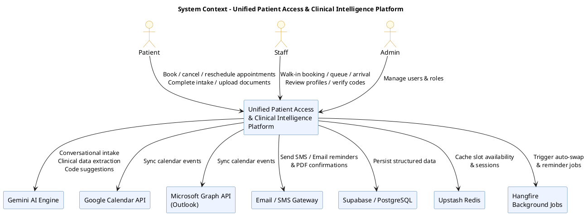

---

### Use Case Specifications

#### UC-001: Patient Self-Registration

- **Actor(s)**: Patient
- **Parent Requirements**: FR-001, FR-040, FR-041
- **Goal**: Create a new patient account using email and password.
- **Preconditions**: User is unauthenticated. Email address is not already registered.
- **Success Scenario**:
  1. User navigates to the registration page.
  2. User enters a valid email address, password meeting complexity rules, and required profile fields.
  3. System validates input, checks email uniqueness, hashes the password, and creates the account with the Patient role.
  4. System records an immutable audit log entry for the registration event.
  5. System redirects the user to the login page with a success message.
- **Extensions/Alternatives**:
  - 2a. Email address already exists → System returns a validation error; does not disclose whether the email is registered (prevents enumeration).
  - 2b. Password does not meet complexity rules → System returns specific validation feedback.
  - 3a. Database write fails → System returns a generic error; no partial account is created.
- **Postconditions**: A new Patient account exists in the system. Audit log contains the registration event.

##### Use Case Diagram

<!-- RENDER type="plantuml" src="./uml-models/uc-patient-registration.png" -->


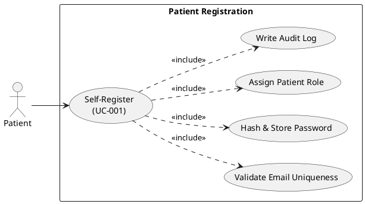

---

#### UC-002: Patient Login

- **Actor(s)**: Patient, Staff, Admin
- **Parent Requirements**: FR-002, FR-004, FR-040
- **Goal**: Authenticate and obtain a session to access role-permitted features.
- **Preconditions**: A valid account exists for the provided credentials.
- **Success Scenario**:
  1. User navigates to the login page.
  2. User submits email and password.
  3. System verifies credentials against the hashed password.
  4. System issues a secure session token and records a login audit event.
  5. System redirects user to their role-specific dashboard.
- **Extensions/Alternatives**:
  - 3a. Credentials are invalid → System increments failed-attempt counter; returns a generic "invalid credentials" message (no field-level disclosure).
  - 3b. Account is deactivated → System returns a generic error; does not confirm account existence.
  - 3c. Failed attempts exceed threshold → System locks the account temporarily and notifies the registered email.
- **Postconditions**: Authenticated session token is active. Audit log records successful login.

##### Use Case Diagram

<!-- RENDER type="plantuml" src="./uml-models/uc-patient-login.png" -->


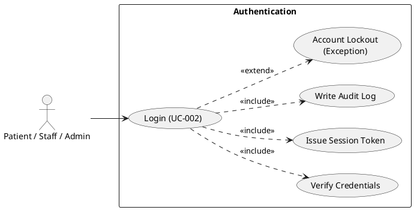

---

#### UC-003: Session Timeout

- **Actor(s)**: Patient, Staff, Admin, System
- **Parent Requirements**: FR-003
- **Goal**: Automatically terminate an inactive session after 15 minutes.
- **Preconditions**: User has an active authenticated session with no interaction for 15 minutes.
- **Success Scenario**:
  1. System detects 15 minutes of inactivity on an authenticated session.
  2. System invalidates the session token.
  3. System records a session-timeout audit event.
  4. On the user's next interaction, system redirects to the login page with a "session expired" message.
- **Extensions/Alternatives**:
  - 1a. User performs an action within the 15-minute window → System resets the inactivity timer.
  - 4a. User attempts to complete an in-flight form → System preserves form state in local session storage for recovery on re-login (if not containing PHI).
- **Postconditions**: Session token is invalid. User must re-authenticate.

##### Use Case Diagram

<!-- RENDER type="plantuml" src="./uml-models/uc-session-timeout.png" -->


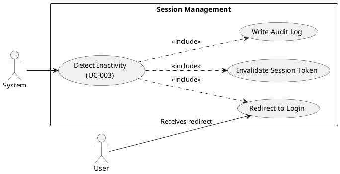

---

#### UC-004: Book an Appointment

- **Actor(s)**: Patient
- **Parent Requirements**: FR-005, FR-008, FR-009, FR-014
- **Goal**: Book an available appointment slot and optionally register a preferred slot.
- **Preconditions**: Patient is authenticated. At least one available slot exists.
- **Success Scenario**:
  1. Patient navigates to the appointment booking screen.
  2. System fetches and displays real-time available slots from Redis-backed slot inventory.
  3. Patient selects a desired available slot.
  4. System calculates no-show risk score using rule-based logic and stores it with the appointment record.
  5. Patient optionally selects a preferred (unavailable) slot for waitlist registration (→ triggers UC-007).
  6. Patient provides or confirms insurance details (→ triggers UC-018).
  7. System creates the appointment record, triggers PDF generation (→ triggers UC-025), and updates slot availability.
  8. System confirms booking on-screen and emails the PDF confirmation.
- **Extensions/Alternatives**:
  - 3a. Selected slot becomes unavailable between display and submission → System returns a conflict error; refreshes available slots.
  - 6a. Insurance soft-validation fails → System displays a warning but does not block booking.
- **Postconditions**: Appointment record created. Slot marked as booked. PDF confirmation emailed. Preferred slot registered if selected.

##### Use Case Diagram

<!-- RENDER type="plantuml" src="./uml-models/uc-book-appointment.png" -->


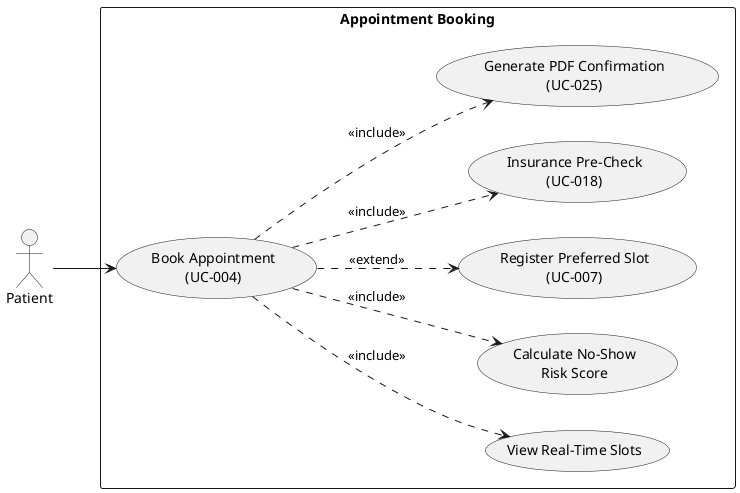

---

#### UC-005: Cancel an Appointment

- **Actor(s)**: Patient
- **Parent Requirements**: FR-006
- **Goal**: Cancel an existing booked appointment and release the slot.
- **Preconditions**: Patient is authenticated. A booked appointment exists for the patient.
- **Success Scenario**:
  1. Patient navigates to their appointment list.
  2. Patient selects an appointment and chooses "Cancel".
  3. System prompts for cancellation confirmation.
  4. Patient confirms cancellation.
  5. System marks the appointment as cancelled, releases the slot to the pool, and notifies any waitlisted patients for that slot via Hangfire job.
  6. System records an audit log entry for the cancellation.
- **Extensions/Alternatives**:
  - 2a. Appointment is in the past → System disables the cancel action for historical records.
  - 4a. Patient abandons confirmation prompt → System takes no action; appointment remains booked.
- **Postconditions**: Appointment status is "Cancelled". Slot is available in the pool. Audit log entry recorded.

##### Use Case Diagram

<!-- RENDER type="plantuml" src="./uml-models/uc-cancel-appointment.png" -->


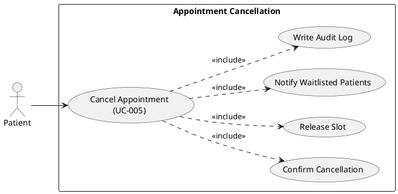

---

#### UC-006: Reschedule an Appointment

- **Actor(s)**: Patient
- **Parent Requirements**: FR-007
- **Goal**: Move a booked appointment to a different available slot.
- **Preconditions**: Patient is authenticated. A booked future appointment exists. At least one alternative slot is available.
- **Success Scenario**:
  1. Patient selects an existing booked appointment and chooses "Reschedule".
  2. System displays available alternative slots.
  3. Patient selects a new slot.
  4. System atomically releases the old slot and reserves the new slot.
  5. System updates the appointment record and emails an updated PDF confirmation.
  6. System records an audit log entry.
- **Extensions/Alternatives**:
  - 3a. Chosen new slot is taken before confirmation → System shows conflict error and refreshes slots.
  - 4a. Old slot release or new slot reservation fails → System rolls back both operations and returns an error.
- **Postconditions**: Appointment is bound to the new slot. Old slot is released. Updated PDF confirmation emailed.

##### Use Case Diagram

<!-- RENDER type="plantuml" src="./uml-models/uc-reschedule-appointment.png" -->


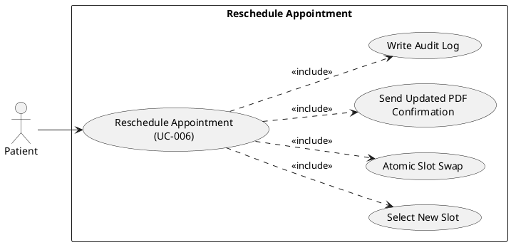

---

#### UC-007: Register Preferred Slot

- **Actor(s)**: Patient
- **Parent Requirements**: FR-010
- **Goal**: Register interest in a currently unavailable preferred slot at the time of booking.
- **Preconditions**: Patient has selected an available slot for booking (UC-004). At least one unavailable slot exists.
- **Success Scenario**:
  1. During the booking flow, system presents unavailable slots as "Register Preferred".
  2. Patient selects one preferred slot.
  3. System creates a waitlist entry linking the patient, their booked appointment, and the preferred slot.
  4. System acknowledges the preferred slot registration to the patient.
- **Extensions/Alternatives**:
  - 2a. Patient skips preferred slot selection → System proceeds without registering a preference.
  - 3a. Patient already has a waitlist entry for the same slot → System replaces the existing entry.
- **Postconditions**: Waitlist entry exists for the patient and preferred slot.

##### Use Case Diagram

<!-- RENDER type="plantuml" src="./uml-models/uc-register-preferred-slot.png" -->


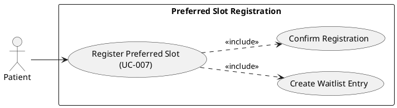

---

#### UC-008: Automatic Preferred Slot Swap

- **Actor(s)**: System (Hangfire), Patient (notified)
- **Parent Requirements**: FR-011, FR-012, FR-013
- **Goal**: Automatically swap a patient's appointment to their registered preferred slot when it becomes available.
- **Preconditions**: A slot becomes available (via cancellation or reschedule). At least one waitlist entry exists for that slot.
- **Success Scenario**:
  1. System detects a slot is released to the pool (triggered by cancellation or reschedule).
  2. Hangfire job evaluates all waitlist entries for that slot, ordered by registration timestamp.
  3. System selects the first eligible waitlist entry.
  4. System atomically moves the patient's appointment from the currently booked slot to the preferred slot.
  5. System releases the patient's previously booked slot back to the pool.
  6. System removes the waitlist entry.
  7. System dispatches a confirmation notification to the patient via Email.
  8. System records an audit log entry for the swap.
- **Extensions/Alternatives**:
  - 3a. No eligible waitlist entries exist → Job completes with no action.
  - 4a. Atomic swap fails → System rolls back; retries once; if second attempt fails, logs the failure and skips the entry.
  - 7a. Email delivery fails → System logs the delivery failure; appointment swap remains in effect.
- **Postconditions**: Appointment is bound to the preferred slot. Previous slot is available. Waitlist entry is removed. Patient notified.

##### Use Case Diagram

<!-- RENDER type="plantuml" src="./uml-models/uc-auto-slot-swap.png" -->


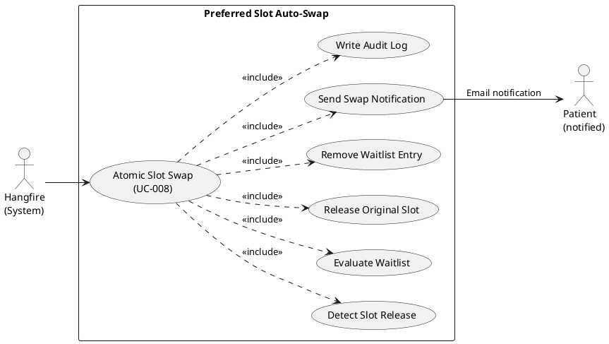

---

#### UC-009: AI Conversational Intake

- **Actor(s)**: Patient, Gemini AI Engine
- **Parent Requirements**: FR-015
- **Goal**: Complete pre-appointment intake using a guided AI conversation.
- **Preconditions**: Patient is authenticated and has a booked appointment. Patient selects the AI intake pathway.
- **Success Scenario**:
  1. Patient initiates the AI intake pathway.
  2. Gemini AI prompts the patient with structured intake questions in conversational language.
  3. Patient responds; Gemini AI parses and maps responses to structured intake fields.
  4. System presents a summary of captured intake data for patient review.
  5. Patient confirms the intake data.
  6. System persists the structured intake record linked to the appointment.
  7. System records an audit log entry.
- **Extensions/Alternatives**:
  - 3a. AI cannot parse a response → System presents the field as a manual input prompt and continues.
  - 5a. Patient edits a field during review → System updates the field value; re-presents the summary.
  - 1a. Patient switches to manual intake (UC-011) → System preserves all fields populated so far.
- **Postconditions**: Structured intake record is persisted against the appointment.

##### Use Case Diagram

<!-- RENDER type="plantuml" src="./uml-models/uc-ai-intake.png" -->


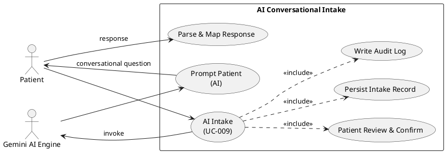

---

#### UC-010: Manual Intake Form

- **Actor(s)**: Patient
- **Parent Requirements**: FR-016
- **Goal**: Complete pre-appointment intake using a structured form.
- **Preconditions**: Patient is authenticated and has a booked appointment. Patient selects the manual form pathway.
- **Success Scenario**:
  1. Patient opens the manual intake form.
  2. System presents all structured intake fields.
  3. Patient fills in required and optional fields.
  4. Patient submits the form.
  5. System validates all required fields; persists the intake record linked to the appointment.
  6. System records an audit log entry.
- **Extensions/Alternatives**:
  - 4a. Required fields are missing → System highlights missing fields and blocks submission.
  - 5a. Patient switches to AI intake (UC-011) → System preserves all fields entered.
- **Postconditions**: Structured intake record is persisted against the appointment.

##### Use Case Diagram

<!-- RENDER type="plantuml" src="./uml-models/uc-manual-intake.png" -->


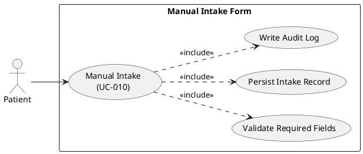

---

#### UC-011: Switch Intake Method

- **Actor(s)**: Patient
- **Parent Requirements**: FR-017
- **Goal**: Switch between AI conversational and manual intake at any point without data loss.
- **Preconditions**: Patient is in an active intake session (AI or manual).
- **Success Scenario**:
  1. Patient selects the alternate intake method button.
  2. System maps all already-captured fields from the current method to the equivalent fields in the target method.
  3. System initialises the target intake form/conversation with pre-populated data.
  4. Patient continues intake from the point of switch.
- **Extensions/Alternatives**:
  - 2a. A field in the current method has no equivalent in the target → System marks the field for manual entry in the target view.
- **Postconditions**: Patient is in the target intake session; all previously captured data is preserved.

##### Use Case Diagram

<!-- RENDER type="plantuml" src="./uml-models/uc-switch-intake.png" -->


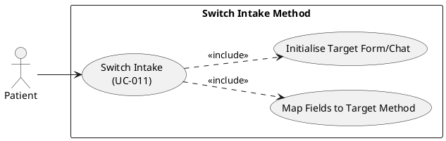

---

#### UC-012: Send Appointment Reminder / Notification

- **Actor(s)**: System (Hangfire), Email/SMS Gateway
- **Parent Requirements**: FR-018, FR-019
- **Goal**: Deliver scheduled appointment reminders and event-driven notifications to patients.
- **Preconditions**: A future appointment exists with a patient's registered email and/or phone. Hangfire reminder job is configured.
- **Success Scenario**:
  1. Hangfire job triggers at configured intervals before appointment date.
  2. System retrieves appointment and patient contact details.
  3. System composes reminder message with appointment details.
  4. System dispatches message via Email and SMS Gateway.
  5. System logs the delivery status and records an audit event.
- **Extensions/Alternatives**:
  - 4a. Email or SMS delivery fails → System records the failure; retries up to a configured maximum; logs persistent failure.
  - 1a. For slot swap notifications → job is triggered immediately by UC-008 completion rather than a scheduled interval.
- **Postconditions**: Reminder or notification delivered (or delivery failure logged).

##### Use Case Diagram

<!-- RENDER type="plantuml" src="./uml-models/uc-send-reminder.png" -->


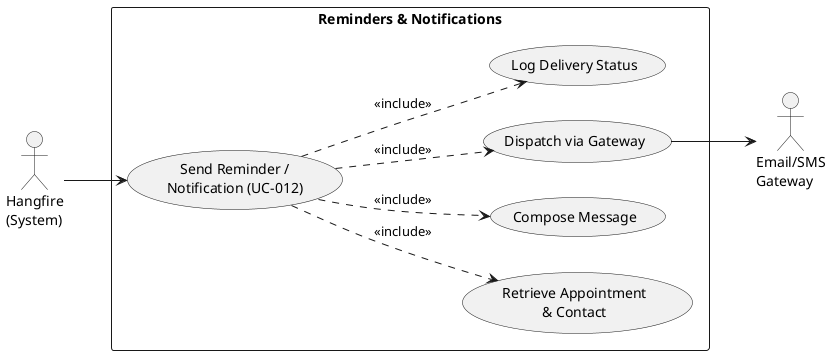

---

#### UC-013: Sync Appointment to Calendar

- **Actor(s)**: Patient, Google Calendar API, Microsoft Graph API (Outlook)
- **Parent Requirements**: FR-020, FR-021
- **Goal**: Reflect appointment booking, rescheduling, or cancellation in the patient's external calendar.
- **Preconditions**: Patient has authorised calendar access via OAuth. An appointment event has been created, updated, or cancelled.
- **Success Scenario**:
  1. Patient grants OAuth consent for calendar access (one-time per provider).
  2. On appointment creation → System creates a calendar event in the authorised provider via API.
  3. On appointment reschedule → System updates the calendar event.
  4. On appointment cancellation → System deletes the calendar event.
  5. System records sync status for each operation.
- **Extensions/Alternatives**:
  - 1a. Patient denies OAuth consent → System proceeds without calendar sync; records that sync is not authorised.
  - 2a–4a. API call fails → System logs the failure; retries once; if retry fails, queues for background retry.
- **Postconditions**: Calendar event reflects the current state of the appointment for all authorised providers.

##### Use Case Diagram

<!-- RENDER type="plantuml" src="./uml-models/uc-calendar-sync.png" -->


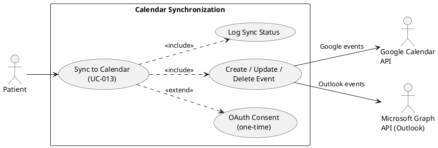

---

#### UC-014: Staff Walk-in Booking

- **Actor(s)**: Staff
- **Parent Requirements**: FR-022, FR-023
- **Goal**: Book an appointment for a walk-in patient without requiring the patient to log in.
- **Preconditions**: Staff user is authenticated. A walk-in patient presents at the front desk. At least one available slot exists.
- **Success Scenario**:
  1. Staff navigates to the walk-in booking screen.
  2. Staff searches for an existing patient account or enters new patient details.
  3. Staff selects an available slot.
  4. System creates the appointment linked to the patient record (existing or anonymous).
  5. Staff optionally creates a new patient account and links it to the walk-in record (FR-023).
  6. System records an audit log entry attributing the booking to the Staff actor.
- **Extensions/Alternatives**:
  - 2a. No matching patient account found → Staff can proceed with anonymous booking or create a new account (step 5).
  - 3a. No available slots → Staff can place patient in the same-day queue (UC-015).
- **Postconditions**: Walk-in appointment exists. Slot is marked as booked. Audit log entry attributed to Staff.

##### Use Case Diagram

<!-- RENDER type="plantuml" src="./uml-models/uc-walkin-booking.png" -->


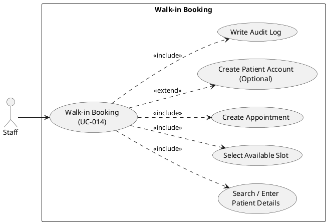

---

#### UC-015: Manage Same-Day Queue

- **Actor(s)**: Staff
- **Parent Requirements**: FR-024
- **Goal**: View and manage the live queue of patients attending on the current day.
- **Preconditions**: Staff user is authenticated. It is the current operational day with at least one booked appointment.
- **Success Scenario**:
  1. Staff navigates to the same-day queue dashboard.
  2. System displays all today's appointments ordered by scheduled time, with status indicators.
  3. Staff can reorder entries (e.g., to accommodate emergencies).
  4. Staff can remove a patient from the queue (no-show or error).
  5. All queue modifications are recorded in the audit log.
- **Extensions/Alternatives**:
  - 3a. Reorder conflicts with a slot constraint → System warns Staff but allows override.
  - 4a. Staff removes a patient → System prompts for reason; records reason in audit log.
- **Postconditions**: Queue reflects staff-applied order and status updates. Audit log entries created for each modification.

##### Use Case Diagram

<!-- RENDER type="plantuml" src="./uml-models/uc-same-day-queue.png" -->


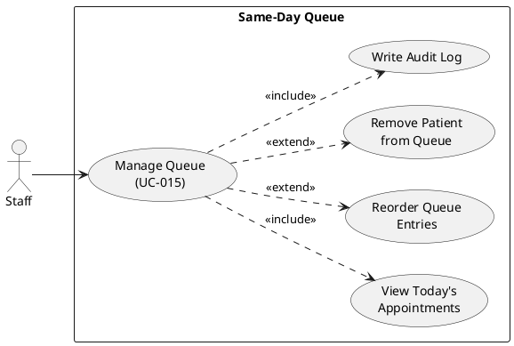

---

#### UC-016: Mark Patient Arrived

- **Actor(s)**: Staff
- **Parent Requirements**: FR-025, FR-026
- **Goal**: Record that a patient has arrived for their appointment; ensure no patient-initiated check-in is possible.
- **Preconditions**: Staff is authenticated. A booked appointment exists for the patient on the current day.
- **Success Scenario**:
  1. Staff locates the patient in the same-day queue.
  2. Staff selects "Mark Arrived" for the patient's appointment.
  3. System updates the appointment status to "Arrived".
  4. System timestamps the arrival and records an audit log entry attributing the action to the Staff actor.
- **Extensions/Alternatives**:
  - 2a. Appointment not found → Staff can search by patient name or ID.
  - 1a. Patient attempts to self-check-in via web or QR → System rejects the request with an access-denied response.
- **Postconditions**: Appointment status is "Arrived". Audit log entry records Staff actor and timestamp.

##### Use Case Diagram

<!-- RENDER type="plantuml" src="./uml-models/uc-mark-arrived.png" -->


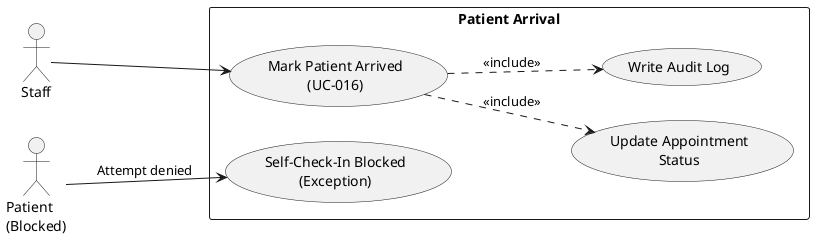

---

#### UC-017: Admin Manage Users and Roles

- **Actor(s)**: Admin
- **Parent Requirements**: FR-027, FR-028
- **Goal**: Create, update, deactivate, or change the role of any user account.
- **Preconditions**: Admin is authenticated.
- **Success Scenario**:
  1. Admin navigates to user management dashboard.
  2. Admin searches for or selects a user account.
  3. Admin creates a new account, updates profile fields, deactivates the account, or changes the user's role.
  4. System applies the change, invalidating any active sessions if the role or account status changes.
  5. System records an audit log entry attributing the change to the Admin actor.
- **Extensions/Alternatives**:
  - 3a. Admin attempts to deactivate their own account → System blocks the action to prevent lockout.
  - 3b. Role change from Admin to a lower role → System warns Admin of impact; requires explicit confirmation.
  - 4a. Active session invalidation fails → System logs the failure; the account change is still applied.
- **Postconditions**: User account reflects the new state. Active sessions invalidated where applicable. Audit log entry recorded.

##### Use Case Diagram

<!-- RENDER type="plantuml" src="./uml-models/uc-admin-user-management.png" -->


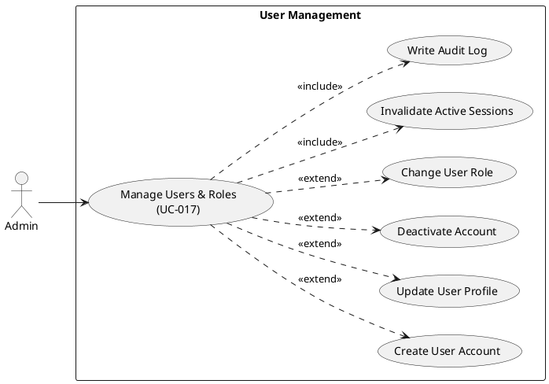

---

#### UC-018: Insurance Soft Validation

- **Actor(s)**: Patient
- **Parent Requirements**: FR-029
- **Goal**: Provide non-blocking validation feedback on the patient's insurance details during booking.
- **Preconditions**: Patient is in the booking flow. Insurance name and ID fields are presented.
- **Success Scenario**:
  1. Patient enters insurance provider name and insurance ID.
  2. System performs a lookup against the internal predefined dummy insurance record set.
  3. System displays a "Validated" or "Not Recognised" indicator alongside the insurance fields.
  4. Booking flow continues regardless of the validation result.
- **Extensions/Alternatives**:
  - 2a. Insurance fields are left blank → System skips validation; records that insurance was not provided.
  - 3a. Result is "Not Recognised" → System displays an advisory message; Patient can correct or proceed.
- **Postconditions**: Insurance validation result is recorded against the appointment. Booking flow is not blocked.

##### Use Case Diagram

<!-- RENDER type="plantuml" src="./uml-models/uc-insurance-check.png" -->


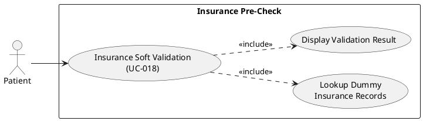

---

#### UC-019: Upload Clinical Document

- **Actor(s)**: Patient
- **Parent Requirements**: FR-030, FR-031, FR-032
- **Goal**: Upload a PDF clinical document (historical or post-visit) for AI extraction and profile consolidation.
- **Preconditions**: Patient is authenticated. A PDF file is available for upload.
- **Success Scenario**:
  1. Patient navigates to the document upload section.
  2. Patient selects a PDF file and a document type (historical / post-visit clinical note).
  3. System validates file type and size.
  4. System stores the document securely in the data layer with encryption.
  5. System queues a Hangfire job for AI extraction (→ triggers UC-021).
  6. System confirms upload and records an audit log entry.
- **Extensions/Alternatives**:
  - 3a. File is not a valid PDF → System rejects with a format error message.
  - 3b. File exceeds maximum size limit → System rejects with a size error message.
  - 5a. AI extraction job fails → System logs the failure; document remains stored; Staff can retry extraction manually.
- **Postconditions**: Document is stored securely. AI extraction job is queued or running. Audit log entry recorded.

##### Use Case Diagram

<!-- RENDER type="plantuml" src="./uml-models/uc-upload-document.png" -->


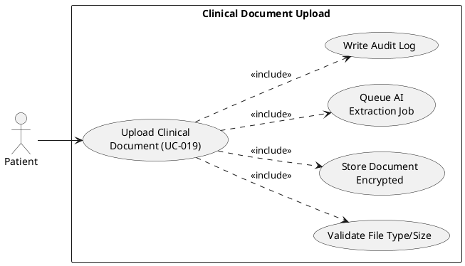

---

#### UC-020: View 360° Patient Profile

- **Actor(s)**: Staff, Patient (read-only own profile)
- **Parent Requirements**: FR-033, FR-034, FR-036
- **Goal**: View the unified, de-duplicated patient profile with all extracted clinical data.
- **Preconditions**: At least one clinical document has been processed for the patient (UC-021 completed). User has access permissions.
- **Success Scenario**:
  1. Authorised user navigates to the patient profile.
  2. System retrieves and renders the unified 360° patient summary: vitals, medical history, medications, and any flagged conflicts.
  3. User can expand each section for detail and view source document references.
  4. If conflicts are flagged, they are displayed in a dedicated conflict section (→ UC-022 if action required).
- **Extensions/Alternatives**:
  - 2a. No documents have been processed yet → System displays a "Profile not yet available" message with upload guidance.
  - 3a. Patient views their own profile → Read-only access; no editing of extracted data.
- **Postconditions**: User has reviewed the unified patient profile.

##### Use Case Diagram

<!-- RENDER type="plantuml" src="./uml-models/uc-view-360-profile.png" -->


```plantuml
@startuml uc-view-360-profile
left to right direction
actor "Staff" as S
actor "Patient\n(read-only)" as P
rectangle "360° Patient Profile" {
  usecase "View 360° Profile\n(UC-020)" as UC020
  usecase "Retrieve Unified Summary" as RUS
  usecase "Render Vitals /\nHistory / Medications" as RENDER
  usecase "Display Conflict\nHighlights (UC-022)" as UC022
}
S --> UC020
P --> UC020
UC020 ..> RUS : <<include>>
UC020 ..> RENDER : <<include>>
UC020 ..> UC022 : <<extend>>
@enduml
```

---

#### UC-021: AI Clinical Data Extraction

- **Actor(s)**: Hangfire (System), Gemini AI Engine
- **Parent Requirements**: FR-032, FR-033
- **Goal**: Extract structured clinical data (vitals, history, medications) from an ingested PDF document.
- **Preconditions**: A PDF document has been stored and an extraction job has been queued (from UC-019).
- **Success Scenario**:
  1. Hangfire job picks up the extraction task.
  2. System retrieves the stored PDF document.
  3. System invokes Gemini AI with the document content and a structured extraction prompt.
  4. Gemini AI returns extracted data: vitals, diagnoses, medications, history.
  5. System validates the extracted data schema.
  6. System stores the extracted structured data linked to the patient and document.
  7. System triggers the de-duplication and conflict detection pipeline (→ feeds UC-020, UC-022).
  8. System records an audit log entry with extraction metadata (model version, confidence, timestamp).
- **Extensions/Alternatives**:
  - 3a. Gemini AI call fails or times out → System retries up to 2 times; after final failure, records extraction failure status; Staff can trigger manual retry.
  - 5a. Extracted data fails schema validation → System stores raw extraction output; flags document for Staff review.
- **Postconditions**: Structured extracted data is stored. Patient 360° profile is updated. Audit log records extraction event.

##### Use Case Diagram

<!-- RENDER type="plantuml" src="./uml-models/uc-ai-extraction.png" -->


```plantuml
@startuml uc-ai-extraction
left to right direction
actor "Hangfire\n(System)" as HF
actor "Gemini AI\nEngine" as AI
rectangle "AI Clinical Data Extraction" {
  usecase "Extract Clinical Data\n(UC-021)" as UC021
  usecase "Retrieve PDF Document" as RPD
  usecase "Invoke Gemini AI" as IGA
  usecase "Validate Extracted Schema" as VES
  usecase "Store Structured Data" as SSD
  usecase "Trigger De-duplication\n& Conflict Pipeline" as TDCP
  usecase "Write Audit Log" as AL
}
HF --> UC021
UC021 ..> RPD : <<include>>
UC021 ..> IGA : <<include>>
IGA --> AI
UC021 ..> VES : <<include>>
UC021 ..> SSD : <<include>>
UC021 ..> TDCP : <<include>>
UC021 ..> AL : <<include>>
@enduml
```

---

#### UC-022: Detect and Review Data Conflicts

- **Actor(s)**: Staff, System
- **Parent Requirements**: FR-035
- **Goal**: Identify, highlight, and allow Staff to review critical data conflicts in the patient profile.
- **Preconditions**: De-duplication pipeline has executed. One or more critical data conflicts have been detected.
- **Success Scenario**:
  1. System identifies conflicting data items (e.g., two documents list different medications for the same condition).
  2. System flags the conflict in the unified patient profile with severity level, conflicting values, and source document references.
  3. Staff views the conflict alert in the patient profile.
  4. Staff reviews conflicting source documents.
  5. Staff resolves the conflict by selecting the authoritative value or marking it as "Reviewed — unresolved".
  6. System records the Staff resolution decision in the audit log.
- **Extensions/Alternatives**:
  - 1a. No conflicts detected → No conflict section is rendered in the profile.
  - 5a. Staff marks conflict as "Reviewed — unresolved" → System retains both values; renders a persistent conflict indicator.
- **Postconditions**: All detected conflicts have a Staff-review status. Audit log records resolution actions.

##### Use Case Diagram

<!-- RENDER type="plantuml" src="./uml-models/uc-conflict-review.png" -->


```plantuml
@startuml uc-conflict-review
left to right direction
actor "Staff" as S
actor "System" as SYS
rectangle "Data Conflict Detection & Review" {
  usecase "Detect & Review Conflicts\n(UC-022)" as UC022
  usecase "Flag Conflict in Profile" as FCP
  usecase "Staff Reviews Conflict" as SRC
  usecase "Resolve / Mark Reviewed" as RMR
  usecase "Write Audit Log" as AL
}
SYS --> UC022
UC022 ..> FCP : <<include>>
S --> SRC
SRC --> RMR
RMR ..> AL : <<include>>
@enduml
```

---

#### UC-023: AI Medical Code Suggestion

- **Actor(s)**: Hangfire (System), Gemini AI Engine
- **Parent Requirements**: FR-037, FR-038
- **Goal**: Generate ICD-10 and CPT code suggestions for a patient encounter.
- **Preconditions**: A 360° patient profile is available for the encounter. Staff has triggered code suggestion or it is automatically triggered post-extraction.
- **Success Scenario**:
  1. System invokes Gemini AI with the patient's extracted clinical data and coding context.
  2. Gemini AI returns ranked ICD-10 and CPT code candidates with confidence scores.
  3. System stores the suggestions against the encounter record.
  4. System presents the suggestions to Staff for human verification (→ UC-024).
  5. System records an audit log entry with the suggestion set, model version, and timestamp.
- **Extensions/Alternatives**:
  - 2a. Gemini AI returns zero suggestions → System surfaces a "No codes suggested" status; Staff performs manual coding.
  - 2b. Gemini AI call fails → System logs the error; retries once; on persistent failure, notifies Staff to code manually.
- **Postconditions**: Code suggestions are stored and available for Staff verification.

##### Use Case Diagram

<!-- RENDER type="plantuml" src="./uml-models/uc-code-suggestion.png" -->


```plantuml
@startuml uc-code-suggestion
left to right direction
actor "Hangfire\n(System)" as HF
actor "Gemini AI\nEngine" as AI
rectangle "Medical Code Suggestion" {
  usecase "AI Code Suggestion\n(UC-023)" as UC023
  usecase "Invoke Gemini\nfor Coding" as IGC
  usecase "Store Suggestions" as SS
  usecase "Present to Staff\n(UC-024)" as UC024
  usecase "Write Audit Log" as AL
}
HF --> UC023
UC023 ..> IGC : <<include>>
IGC --> AI
UC023 ..> SS : <<include>>
UC023 ..> UC024 : <<include>>
UC023 ..> AL : <<include>>
@enduml
```

---

#### UC-024: Human Verification of Medical Codes

- **Actor(s)**: Staff
- **Parent Requirements**: FR-037, FR-038, FR-039
- **Goal**: Review, approve, modify, or reject AI-suggested ICD-10 and CPT codes before they are recorded.
- **Preconditions**: AI code suggestions are available for the encounter (UC-023 completed). Staff is authenticated.
- **Success Scenario**:
  1. Staff opens the code verification screen for the encounter.
  2. System presents each AI-suggested ICD-10 and CPT code with confidence score and supporting evidence.
  3. Staff reviews each suggestion and selects: Accept, Modify (enter corrected code), or Reject.
  4. System records the final accepted/modified codes against the encounter.
  5. System writes an immutable audit entry for each accepted, modified, and rejected code, capturing the Staff actor, AI suggestion, and final decision.
- **Extensions/Alternatives**:
  - 3a. Staff modifies a code → System validates the modified code against the ICD-10 / CPT codeset; rejects invalid codes.
  - 3b. Staff rejects all suggestions → Encounter is flagged for manual coding; audit entry records mass rejection.
- **Postconditions**: All encounter codes have a human-verified status. Immutable audit trail records every AI-human decision.

##### Use Case Diagram

<!-- RENDER type="plantuml" src="./uml-models/uc-code-verification.png" -->


```plantuml
@startuml uc-code-verification
left to right direction
actor "Staff" as S
rectangle "Medical Code Verification" {
  usecase "Verify Medical Codes\n(UC-024)" as UC024
  usecase "Accept Code" as ACC
  usecase "Modify Code" as MOD
  usecase "Reject Code" as REJ
  usecase "Validate Modified Code\nAgainst Codeset" as VMC
  usecase "Write Immutable\nAudit Entry" as AUD
}
S --> UC024
UC024 ..> ACC : <<extend>>
UC024 ..> MOD : <<extend>>
UC024 ..> REJ : <<extend>>
MOD ..> VMC : <<include>>
UC024 ..> AUD : <<include>>
@enduml
```

---

#### UC-025: Generate and Email PDF Confirmation

- **Actor(s)**: System (Hangfire)
- **Parent Requirements**: FR-009
- **Goal**: Generate a PDF appointment confirmation and deliver it to the patient's email address.
- **Preconditions**: An appointment has been successfully created or rescheduled. Patient's registered email is available.
- **Success Scenario**:
  1. System triggers PDF generation job immediately upon appointment confirmation.
  2. System populates the PDF template with appointment details (date, time, provider, location, appointment ID).
  3. System renders the PDF document.
  4. System dispatches the PDF as an email attachment to the patient's registered email via the Email Gateway.
  5. System records delivery status and audit log entry.
- **Extensions/Alternatives**:
  - 3a. PDF rendering fails → System logs the error; retries once; if retry fails, records failure; does not block the appointment.
  - 4a. Email delivery fails → System logs delivery failure; retries up to configured maximum.
- **Postconditions**: PDF confirmation is delivered to patient (or delivery failure logged). Audit log entry recorded.

##### Use Case Diagram

<!-- RENDER type="plantuml" src="./uml-models/uc-pdf-confirmation.png" -->


```plantuml
@startuml uc-pdf-confirmation
left to right direction
actor "Hangfire\n(System)" as HF
actor "Email/SMS\nGateway" as GW
rectangle "PDF Confirmation" {
  usecase "Generate & Email PDF\n(UC-025)" as UC025
  usecase "Populate PDF Template" as PPT
  usecase "Render PDF" as RPDF
  usecase "Dispatch via Email\nGateway" as DEG
  usecase "Log Delivery Status" as LDS
}
HF --> UC025
UC025 ..> PPT : <<include>>
UC025 ..> RPDF : <<include>>
UC025 ..> DEG : <<include>>
UC025 ..> LDS : <<include>>
DEG --> GW
@enduml
```

---

## Risks & Mitigations

- **Gemini AI rate limits or downtime**: Mitigate by implementing retry logic with exponential backoff; fallback to manual intake and manual coding when AI is unavailable.
- **Free-tier infrastructure capacity (MonsterASP, InfinityFree, Supabase)**: Mitigate by implementing Upstash Redis caching for hot data, Hangfire for background job offloading, and aggressive query optimisation. Monitor usage against free-tier limits continuously.
- **HIPAA compliance on free-tier services**: Mitigate by reviewing each provider's Data Processing Agreement (DPA); encrypting all PHI at the application layer before persistence; never storing PHI in log fields.
- **AI-generated code suggestion accuracy below 98% target**: Mitigate by human-in-the-loop verification gate (UC-024) that is mandatory before any code is recorded; track agreement rate in audit telemetry.
- **Preferred slot swap race condition**: Mitigate by implementing optimistic concurrency control on slot records; atomic database transactions for slot reservation and release.
- **Calendar OAuth token expiry**: Mitigate by implementing OAuth token refresh flows; storing refresh tokens securely in GitHub Secrets / environment variables; gracefully degrading when tokens are invalid.
- **No-show rate reduction measurement**: Mitigate by capturing baseline no-show rate before go-live and comparing post-launch metrics via audit log analytics.
- **PDF generation library licence compliance**: Mitigate by selecting an open-source, permissively licensed PDF library compatible with free-tier hosting.

---

## Constraints & Assumptions

- **Phase 1 uses free/open-source infrastructure exclusively**: No paid cloud services (AWS, Azure) are permitted. All hosting must use InfinityFree (React), MonsterASP (.NET), Supabase/PostgreSQL, Upstash Redis, and Hangfire.
- **AI engine is Gemini**: All AI-powered features (conversational intake, clinical extraction, code suggestion) use the Gemini API; no alternative AI engine is in scope for Phase 1.
- **Insurance pre-check uses dummy data**: Validation is soft (non-blocking) against an internal predefined dummy dataset; no live insurer API integration is in scope.
- **No provider-facing portal**: Provider logins and provider-specific actions are out of scope for Phase 1.
- **No payment gateway**: Payment processing is not implemented; the system SHOULD include a payment reservation placeholder for future integration.
- **No family member profiles**: Each account represents a single patient; family member management is out of scope.
- **Calendar sync is read-write from the patient's authorised account only**: The platform does not access provider or clinic calendars.
- **Audit log is immutable**: Once written, audit records MUST NOT be modified or deleted; no administrative override is provided.
- **Session management relies on server-side token invalidation**: Tokens are server-side controlled; client-side storage of tokens uses HttpOnly secure cookies.
- **React frontend is a single-page application (SPA)**: All UI is served from InfinityFree; API calls target the MonsterASP .NET backend.
- **CI/CD is delivered via GitHub Actions**: All automated build and deployment pipelines use GitHub Actions; GitHub Secrets store all credentials and API keys.
- **pgvector is available via Supabase**: Embedding storage for AI features uses the pgvector extension already provisioned in Supabase.
- **Phase 1 success criteria assume a single clinic deployment**: Multi-clinic support is architecturally designed for but not operationally activated in Phase 1.
